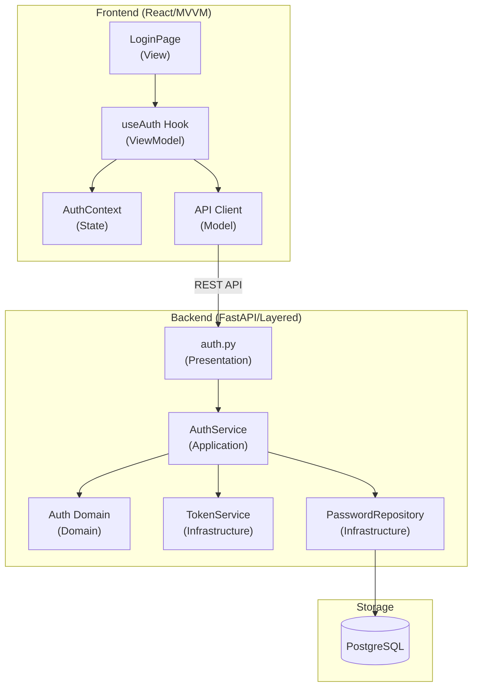
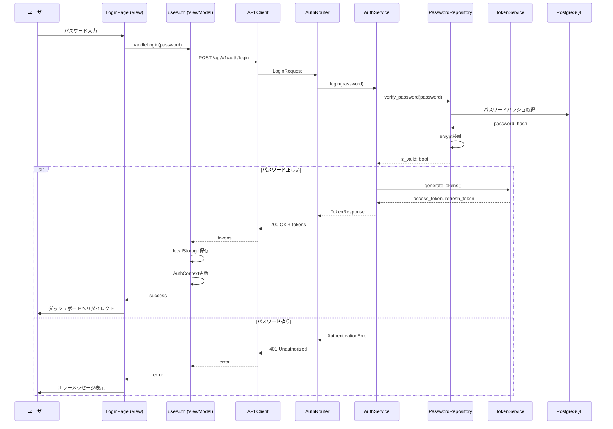
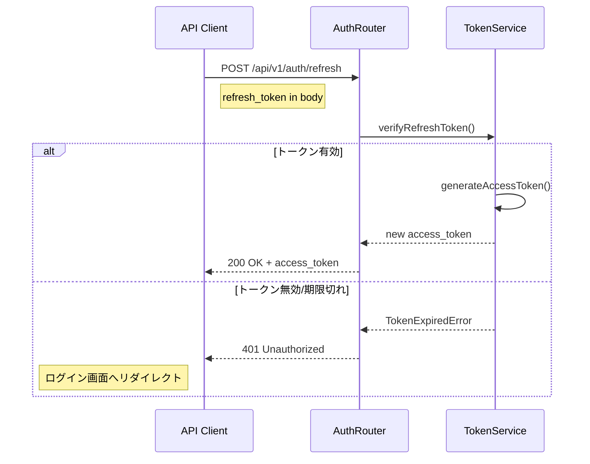
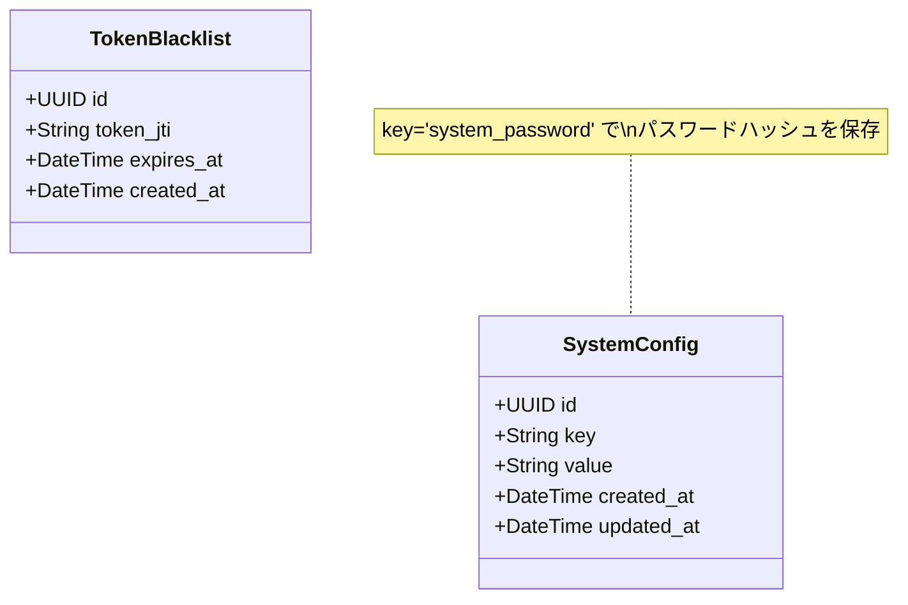

# 設計ドキュメント: 認可機能 (authorization)

## 概要

**目的**: 本機能は、ECG心筋梗塞リスク推論システムへのアクセス制御を提供する。
パスワード認可により、認可されたユーザーのみが患者データや推論機能にアクセスできるようにする。

**ユーザー**: 医療従事者（循環器内科医、心電図検査技師、診療支援スタッフ）が
システムへのログイン・ログアウト、セッション管理を行う。

**特徴**: 本システムはシングルユーザーモデルを採用し、ユーザー名なしのパスワードのみで認可を行う。
これは医療機関内の専用端末での利用を想定しているため。

### ゴール

- パスワードによるシステムアクセス制御の実装
- JWT（アクセストークン/リフレッシュトークン）によるセッション管理
- セキュアなパスワード保存（bcrypt）
- フロントエンド・バックエンド間の認可状態同期

### 非ゴール

- ユーザー管理機能（ユーザー登録、ユーザー一覧等）
- ロールベースアクセス制御（RBAC）
- 多要素認証（MFA）
- OAuth/OIDC連携

## アーキテクチャ

### アーキテクチャパターン

**選択パターン**: MVVM（Frontend） + Layered Architecture（Backend）

**ドメイン境界**:
- Frontend: `features/auth/` に認可関連のView/ViewModelを集約
- Backend: `domain/auth/` にドメインロジック、`infrastructure/` にJWT処理を配置

**ステアリング準拠**:
- DDD原則に従い、ドメイン層は外部依存なし
- MVVMパターンでView/ViewModel分離

### システム境界図



### 技術スタック

| Layer | 選択技術 | 役割 | 備考 |
|-------|----------|------|------|
| Frontend | React + TypeScript | SPA、ログインUI | MVVM構成 |
| State管理 | React Context + TanStack Query | 認可状態管理 | |
| Backend | FastAPI + Python 3.14+ | REST API | Layered構成 |
| 認可 | python-jose (JWT) | トークン生成・検証 | |
| パスワード | bcrypt (passlib) | ハッシュ化 | |
| Database | PostgreSQL | パスワード保存 | |

## システムフロー

### ログインフロー



### トークンリフレッシュフロー



## 要件トレーサビリティ

| 要件 | 概要 | コンポーネント | インターフェース | フロー |
|------|------|---------------|-----------------|--------|
| 1 | ユーザーログイン | LoginPage, useAuth, AuthService | POST /auth/login | ログインフロー |
| 2 | セッション管理 | TokenService, useAuth | POST /auth/refresh | リフレッシュフロー |
| 3 | アクセス制御 | AuthMiddleware, ProtectedRoute | Bearer Token | - |
| 4 | ログアウト | useAuth, AuthService | POST /auth/logout | - |
| 5 | パスワードポリシー | PasswordValidator | - | - |
| 6 | 認可状態永続化 | useAuth (localStorage) | - | - |

## コンポーネントとインターフェース

### コンポーネント一覧

| コンポーネント | ドメイン/レイヤー | 役割 | 要件 | 依存関係 |
|---------------|------------------|------|------|---------|
| LoginPage | Frontend/View | ログインUI | 1, 5 | useAuth |
| useAuth | Frontend/ViewModel | 認可状態管理 | 1, 2, 4, 6 | API Client |
| AuthContext | Frontend/State | グローバル認可状態 | 3, 6 | - |
| ProtectedRoute | Frontend/View | ルート保護 | 3 | AuthContext |
| AuthRouter | Backend/Presentation | APIエンドポイント | 1, 2, 4 | AuthService |
| AuthService | Backend/Application | 認可ユースケース | 1, 2, 4 | TokenService, PasswordRepository |
| TokenService | Backend/Infrastructure | JWT生成・検証 | 2 | - |
| PasswordRepository | Backend/Infrastructure | パスワード永続化 | 1, 5 | PostgreSQL |
| AuthMiddleware | Backend/Presentation | リクエスト認可検証 | 3 | TokenService |

---

### Frontend

#### LoginPage (View)

| Field | Detail |
|-------|--------|
| Intent | パスワード入力フォームとログイン処理のUI |
| Requirements | 1, 5 |
| Path | `frontend/src/features/auth/components/LoginPage.tsx` |

**責務と制約**
- パスワード入力フォームの表示
- パスワード強度インジケーターの表示
- エラーメッセージの表示
- ログイン成功時のリダイレクト

**依存関係**
- Inbound: なし
- Outbound: useAuth Hook（認可処理）

**Contracts**: State [x]

##### State Management

```typescript
interface LoginPageState {
  password: string;
  showPassword: boolean;
  passwordStrength: 'weak' | 'medium' | 'strong';
}
```

---

#### useAuth (ViewModel)

| Field | Detail |
|-------|--------|
| Intent | 認可状態の管理とAPI呼び出し |
| Requirements | 1, 2, 4, 6 |
| Path | `frontend/src/features/auth/hooks/useAuth.ts` |

**責務と制約**
- ログイン/ログアウト処理
- トークンのlocalStorage保存・取得
- 認可状態のContext更新
- トークンリフレッシュ処理

**依存関係**
- Inbound: LoginPage, ProtectedRoute
- Outbound: API Client, AuthContext

**Contracts**: Service [x] / State [x]

##### Service Interface

```typescript
interface UseAuthReturn {
  // 状態
  isAuthenticated: boolean;
  isLoading: boolean;
  error: string | null;

  // アクション
  login: (password: string) => Promise<void>;
  logout: () => Promise<void>;
  refreshToken: () => Promise<void>;
}

function useAuth(): UseAuthReturn;
```

##### State Management

```typescript
interface AuthState {
  isAuthenticated: boolean;
  accessToken: string | null;
  refreshToken: string | null;
  expiresAt: number | null;
}
```

- Persistence: localStorage（`auth_access_token`, `auth_refresh_token`）
- 初期化時にlocalStorageからトークン復元
- **自動リフレッシュメカニズム:**
  - アクセストークンの有効期限が残り1時間以内の場合、次のAPIリクエスト時に自動的にリフレッシュトークンを使用して新しいアクセストークンを取得
  - アクセストークンが期限切れの場合も、リフレッシュトークンが有効であれば自動的に新しいアクセストークンを取得してAPIリクエストを再実行
  - リフレッシュトークンの有効期限（24時間）が切れた場合のみ、ログイン画面へリダイレクト

---

#### AuthContext (State)

| Field | Detail |
|-------|--------|
| Intent | アプリケーション全体での認可状態共有 |
| Requirements | 3, 6 |
| Path | `frontend/src/features/auth/AuthContext.tsx` |

**Contracts**: State [x]

```typescript
interface AuthContextValue {
  isAuthenticated: boolean;
  accessToken: string | null;
  setAuth: (token: string | null) => void;
  clearAuth: () => void;
}

const AuthContext = React.createContext<AuthContextValue | null>(null);
```

---

#### ProtectedRoute (View)

| Field | Detail |
|-------|--------|
| Intent | 未認可ユーザーのルートアクセス防止 |
| Requirements | 3 |
| Path | `frontend/src/features/auth/components/ProtectedRoute.tsx` |

```typescript
interface ProtectedRouteProps {
  children: React.ReactNode;
}

// 未認可時はログイン画面へリダイレクト
const ProtectedRoute: React.FC<ProtectedRouteProps>;
```

---

### Backend

#### AuthRouter (Presentation Layer)

| Field | Detail |
|-------|--------|
| Intent | 認可関連APIエンドポイントの定義 |
| Requirements | 1, 2, 4 |
| Path | `backend/app/api/v1/auth.py` |

**Contracts**: API [x]

##### API Contract

| Method | Endpoint | Request | Response | Errors |
|--------|----------|---------|----------|--------|
| POST | /api/v1/auth/login | LoginRequest | TokenResponse | 401, 422 |
| POST | /api/v1/auth/refresh | RefreshRequest | AccessTokenResponse | 401 |
| POST | /api/v1/auth/logout | - | MessageResponse | 401 |
| PUT | /api/v1/auth/password | ChangePasswordRequest | MessageResponse | 401, 422 |

---

#### AuthService (Application Layer)

| Field | Detail |
|-------|--------|
| Intent | 認可ユースケースの実装 |
| Requirements | 1, 2, 4 |
| Path | `backend/app/services/auth_service.py` |

**責務と制約**
- パスワード検証ロジック
- トークン発行の調整
- ログアウト処理（トークン無効化）

**依存関係**
- Inbound: AuthRouter
- Outbound: TokenService, PasswordRepository

**Contracts**: Service [x]

##### Service Interface

```python
class AuthService:
    async def login(self, password: str) -> TokenPair:
        """
        パスワードを検証し、トークンペアを発行する

        Raises:
            AuthenticationError: パスワードが正しくない場合
        """
        pass

    async def refresh_token(self, refresh_token: str) -> str:
        """
        リフレッシュトークンを検証し、新しいアクセストークンを発行する

        Raises:
            TokenExpiredError: トークンが期限切れの場合
            InvalidTokenError: トークンが無効な場合
        """
        pass

    async def logout(self, access_token: str) -> None:
        """
        トークンを無効化し、セッションを終了する
        """
        pass

    async def change_password(
        self,
        current_password: str,
        new_password: str
    ) -> None:
        """
        パスワードを変更する

        Raises:
            AuthenticationError: 現在のパスワードが正しくない場合
            PasswordPolicyError: 新しいパスワードがポリシーを満たさない場合
        """
        pass
```

---

#### TokenService (Infrastructure Layer)

| Field | Detail |
|-------|--------|
| Intent | JWT トークンの生成・検証 |
| Requirements | 2 |
| Path | `backend/app/infrastructure/auth/token_service.py` |

**Contracts**: Service [x]

##### Service Interface

```python
@dataclass
class TokenPair:
    access_token: str
    refresh_token: str
    access_expires_at: datetime
    refresh_expires_at: datetime

class TokenService:
    def generate_access_token(self) -> tuple[str, datetime]:
        """アクセストークンを生成（有効期限: 8時間）"""
        pass

    def generate_refresh_token(self) -> tuple[str, datetime]:
        """リフレッシュトークンを生成（有効期限: 24時間）"""
        pass

    def generate_token_pair(self) -> TokenPair:
        """アクセストークンとリフレッシュトークンのペアを生成"""
        pass

    def verify_access_token(self, token: str) -> dict:
        """
        アクセストークンを検証

        Raises:
            TokenExpiredError: トークンが期限切れ
            InvalidTokenError: トークンが無効
        """
        pass

    def verify_refresh_token(self, token: str) -> dict:
        """リフレッシュトークンを検証"""
        pass
```

**実装ノート**
- JWT署名アルゴリズム: HS256
- シークレットキーは環境変数 `JWT_SECRET_KEY` から取得
- トークンペイロード: `{ "type": "access|refresh", "exp": timestamp, "iat": timestamp }`

---

#### PasswordRepository (Infrastructure Layer)

| Field | Detail |
|-------|--------|
| Intent | システムパスワードの永続化 |
| Requirements | 1, 5 |
| Path | `backend/app/infrastructure/repositories/password_repository.py` |

**Contracts**: Service [x]

```python
class PasswordRepository:
    async def get_password_hash(self) -> str:
        """保存されているパスワードハッシュを取得"""
        pass

    async def update_password_hash(self, new_hash: str) -> None:
        """パスワードハッシュを更新"""
        pass

    async def verify_password(self, plain_password: str) -> bool:
        """パスワードを検証"""
        pass
```

**実装ノート**
- bcrypt work factor: 12
- パスワードは `system_config` テーブルに保存

---

#### AuthMiddleware (Presentation Layer)

| Field | Detail |
|-------|--------|
| Intent | APIリクエストの認可検証 |
| Requirements | 3 |
| Path | `backend/app/core/middleware/auth_middleware.py` |

```python
async def get_current_user(
    authorization: str = Header(...)
) -> dict:
    """
    Authorizationヘッダーからトークンを検証

    Raises:
        HTTPException(401): トークンが無効または期限切れ
    """
    pass
```

**実装ノート**
- `Authorization: Bearer <token>` 形式
- 除外パス: `/api/v1/auth/login`, `/api/v1/auth/refresh`, `/docs`, `/openapi.json`

---

#### PasswordValidator (Domain Layer)

| Field | Detail |
|-------|--------|
| Intent | パスワードポリシーの検証 |
| Requirements | 5 |
| Path | `backend/app/domain/auth/password_validator.py` |

```python
@dataclass
class PasswordValidationResult:
    is_valid: bool
    errors: list[str]
    strength: Literal['weak', 'medium', 'strong']

class PasswordValidator:
    MIN_LENGTH = 8

    def validate(self, password: str) -> PasswordValidationResult:
        """
        パスワードポリシーを検証

        ポリシー:
        - 最低8文字以上
        - 大文字・小文字・数字・記号のうち3種類以上
        """
        pass

    def calculate_strength(self, password: str) -> Literal['weak', 'medium', 'strong']:
        """パスワード強度を計算"""
        pass
```

---

## データモデル

### ドメインモデル



### 物理データモデル

#### system_config テーブル

```sql
CREATE TABLE system_config (
    id UUID PRIMARY KEY DEFAULT uuid_generate_v4(),
    key VARCHAR(255) UNIQUE NOT NULL,
    value TEXT NOT NULL,
    created_at TIMESTAMP WITH TIME ZONE DEFAULT NOW(),
    updated_at TIMESTAMP WITH TIME ZONE DEFAULT NOW()
);

-- パスワードハッシュ保存
INSERT INTO system_config (key, value)
VALUES ('system_password', '$2b$12$...'); -- bcryptハッシュ
```

#### token_blacklist テーブル

```sql
CREATE TABLE token_blacklist (
    id UUID PRIMARY KEY DEFAULT uuid_generate_v4(),
    token_jti VARCHAR(255) UNIQUE NOT NULL,
    expires_at TIMESTAMP WITH TIME ZONE NOT NULL,
    created_at TIMESTAMP WITH TIME ZONE DEFAULT NOW()
);

-- 期限切れトークンの自動削除用インデックス
CREATE INDEX idx_token_blacklist_expires_at ON token_blacklist(expires_at);
```

### データ契約

#### リクエスト/レスポンススキーマ

```python
# schemas/auth.py

class LoginRequest(BaseModel):
    password: str = Field(..., min_length=1)

class TokenResponse(BaseModel):
    access_token: str
    refresh_token: str
    token_type: str = "bearer"
    expires_in: int  # 秒

class AccessTokenResponse(BaseModel):
    access_token: str
    token_type: str = "bearer"
    expires_in: int

class RefreshRequest(BaseModel):
    refresh_token: str

class ChangePasswordRequest(BaseModel):
    current_password: str
    new_password: str = Field(..., min_length=8)

class MessageResponse(BaseModel):
    message: str

class ErrorResponse(BaseModel):
    detail: str
```

---

## エラーハンドリング

### エラー戦略

| エラー種別 | HTTPステータス | レスポンス | UI対応 |
|-----------|---------------|-----------|--------|
| パスワード誤り | 401 | `{"detail": "パスワードが正しくありません"}` | エラーメッセージ表示、パスワードクリア |
| トークン期限切れ | 401 | `{"detail": "セッションの有効期限が切れました"}` | ログイン画面へリダイレクト |
| トークン無効 | 401 | `{"detail": "認可が必要です"}` | ログイン画面へリダイレクト |
| パスワードポリシー違反 | 422 | `{"detail": "パスワードは8文字以上..."}` | バリデーションエラー表示 |

### モニタリング

- ログイン成功/失敗をINFOレベルでログ記録
- 連続ログイン失敗はWARNINGレベル
- トークン検証エラーはDEBUGレベル

---

## テスト戦略

### 単体テスト

| 対象 | テスト内容 |
|------|-----------|
| PasswordValidator | ポリシー検証、強度計算 |
| TokenService | トークン生成、検証、期限切れ処理 |
| useAuth Hook | 状態遷移、localStorage操作 |

### 統合テスト

| 対象 | テスト内容 |
|------|-----------|
| POST /auth/login | 正常ログイン、パスワード誤り |
| POST /auth/refresh | 正常リフレッシュ、期限切れトークン |
| AuthMiddleware | 保護エンドポイントへのアクセス制御 |

### E2Eテスト

| シナリオ | 内容 |
|---------|------|
| ログインフロー | パスワード入力→ダッシュボード表示 |
| セッション期限切れ | 8時間後の自動ログアウト |
| ログアウト | ログアウト→ログイン画面表示 |

---

## セキュリティ考慮事項

### 脅威と対策

| 脅威 | 対策 |
|------|------|
| ブルートフォース攻撃 | レートリミット（10回/分） |
| XSS | HttpOnly Cookie（オプション）、CSP |
| CSRF | SameSite Cookie、CSRFトークン |
| トークン漏洩 | 短い有効期限、HTTPS必須 |

### トークン保存方針

| 方式 | メリット | デメリット | 採用 |
|------|---------|-----------|------|
| localStorage | 実装シンプル | XSS脆弱 | ○（初期実装） |
| HttpOnly Cookie | XSS耐性 | CSRF対策必要 | △（将来検討） |

---

## ファイル配置

```
frontend/src/features/auth/
├── components/
│   ├── LoginPage.tsx
│   ├── LoginPage.stories.tsx
│   ├── LoginPage.test.tsx
│   ├── ProtectedRoute.tsx
│   └── PasswordStrengthIndicator.tsx
├── hooks/
│   ├── useAuth.ts
│   └── useAuth.test.ts
├── AuthContext.tsx
└── index.ts

backend/app/
├── api/v1/
│   └── auth.py
├── domain/auth/
│   ├── password_validator.py
│   └── exceptions.py
├── services/
│   └── auth_service.py
├── infrastructure/
│   ├── auth/
│   │   └── token_service.py
│   └── repositories/
│       └── password_repository.py
├── schemas/
│   └── auth.py
└── core/
    └── middleware/
        └── auth_middleware.py
```

---

## デプロイメント・インストールノート

### 初期パスワード設定

システムの初回起動時に、管理者パスワードを設定する必要がある。

**設定方法**:

```bash
# 方法1: 環境変数で初期パスワードを指定
INITIAL_ADMIN_PASSWORD="SecureP@ssw0rd" docker compose up -d

# 方法2: CLIツールで設定（本番環境推奨）
cd backend
python -m app.cli set-password
# インタラクティブにパスワードを入力
```

**初期化フロー**:
1. システム起動時に `system_config` テーブルの `system_password` を確認
2. 未設定の場合:
   - 環境変数 `INITIAL_ADMIN_PASSWORD` があれば使用
   - なければ初期設定画面を表示（または起動エラー）
3. パスワードはbcryptでハッシュ化してDBに保存

### 環境変数

| 変数名 | 必須 | デフォルト | 説明 |
|--------|------|-----------|------|
| `JWT_SECRET_KEY` | ✓ | - | JWTトークン署名用シークレット（32文字以上推奨） |
| `JWT_ACCESS_TOKEN_EXPIRE_HOURS` | - | 8 | アクセストークン有効期限（時間） |
| `JWT_REFRESH_TOKEN_EXPIRE_HOURS` | - | 24 | リフレッシュトークン有効期限（時間） |
| `INITIAL_ADMIN_PASSWORD` | - | - | 初回起動時の管理者パスワード |
| `PASSWORD_MIN_LENGTH` | - | 8 | パスワード最小文字数 |

### ドキュメント参照

詳細なインストール・デプロイ手順は以下を参照:
- `README.md` - クイックスタート、開発環境セットアップ
- `docs/deployment.md` - 本番環境デプロイ手順（作成予定）
- `docs/security.md` - セキュリティ設定ガイド（作成予定）

---

**ステータス:** レビュー待ち
**作成日:** 2025-12-07
**最終更新:** 2025-12-07

