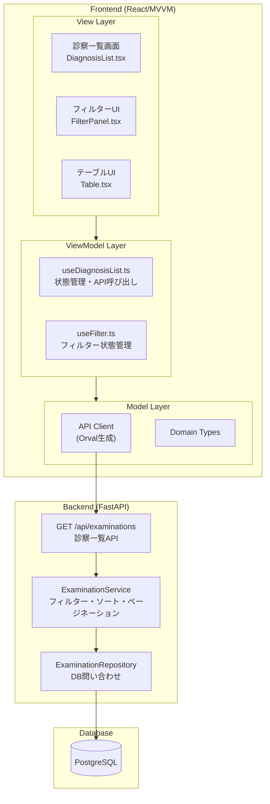

# 要件定義書: 診察一覧機能 (diagnosis-list)

## はじめに

本ドキュメントは、ECG心筋梗塞リスク推論システムにおける診察一覧機能の要件を定義する。
本機能は、システムユーザー（医療従事者）がDB登録済みの診察データを一覧表示し、患者情報でフィルタリングして検索できるフロントエンド機能である。

**責務境界:**
- **diagnosis-list（本機能）**: 診察データの一覧表示、フィルタリング、ソート、ページネーション、診察選択
- **file-importer**: 診察データのDB登録（本機能のデータソース）
- **ecg-mi-inference（別途定義）**: 診察選択後の心筋梗塞リスク推論実行

**関連ユースケース:**
- UC-3: システムユーザーはDB登録済みの診察データを一覧表示できる
- UC-3-extend: システムユーザーは患者情報で診察データにフィルター条件を指定して一覧する

**技術選定:** React（MVVMアーキテクチャ）、TanStack Query（サーバー状態管理）、Orval（API型定義）

## 要件一覧

### 要件1: 診察データの一覧表示

**目的:** 医療従事者として、登録済みの診察データを一覧で確認したい。
これにより、処理済みの診察を把握し、推論対象を選択できる。

#### 受け入れ基準

1. When ユーザーが診察一覧画面にアクセスする, 診察一覧機能 shall DBから診察データを取得しテーブル形式で表示する
2. 診察一覧機能 shall 以下のカラムを表示する：検査日時、患者ID、患者氏名、性別、年齢
3. 診察一覧機能 shall 診察データを検査日時（降順：新しい順）でソートして表示する
4. 診察一覧機能 shall デフォルトで20件ずつページネーションする
5. 診察一覧機能 shall ページサイズを環境変数または設定で変更可能とする（10件/20件/50件/100件）
6. 診察一覧機能 shall 現在のページ情報を表示する（例: 「1-20」）
7. 診察一覧機能 shall 総件数は表示しない
8. When データ取得中, 診察一覧機能 shall ローディングインジケーターを表示する
9. When データ取得に失敗した場合, 診察一覧機能 shall エラーメッセージを表示する

### 要件2: 患者情報でのフィルタリング

**目的:** 医療従事者として、特定の患者の診察データのみを表示したい。
これにより、大量の診察データから目的の診察を効率的に検索できる。

#### 受け入れ基準

1. 診察一覧機能 shall 患者IDによる検索フィールドを提供する
2. 診察一覧機能 shall 患者氏名による部分一致検索フィールドを提供する
3. 診察一覧機能 shall 検査日時の範囲指定（開始日～終了日）を提供する
4. 診察一覧機能 shall フィルター条件が入力された場合のみフィルターを適用する
5. 診察一覧機能 shall フィルター条件をクリアするボタンを提供する
6. When フィルター条件が変更される, 診察一覧機能 shall 自動的に検索を実行する（デバウンス: 500ms）
7. When フィルター結果が0件の場合, 診察一覧機能 shall 「該当する診察データがありません」というメッセージを表示する

### 要件3: ソート機能

**目的:** 医療従事者として、診察データを任意のカラムでソートしたい。
これにより、診察データを様々な視点で整理して確認できる。

#### 受け入れ基準

1. 診察一覧機能 shall 検査日時カラムをクリックでソート可能とする（昇順/降順）
2. 診察一覧機能 shall 患者IDカラムをクリックでソート可能とする（昇順/降順）
3. 診察一覧機能 shall 患者氏名カラムをクリックでソート可能とする（昇順/降順）
4. 診察一覧機能 shall 年齢カラムをクリックでソート可能とする（昇順/降順）
5. 診察一覧機能 shall 現在のソートカラムと方向を視覚的に表示する（▲/▼アイコン）
6. 診察一覧機能 shall ソート条件をクエリパラメータで保持する（ページリロード時も維持）

### 要件4: 診察選択

**目的:** 医療従事者として、一覧から診察を選択して詳細表示や推論実行に進みたい。
これにより、選択した診察に対して後続の操作を実行できる。

#### 受け入れ基準

1. 診察一覧機能 shall 各行をクリックで診察を選択可能とする
2. 診察一覧機能 shall 選択された行を視覚的にハイライト表示する
3. 診察一覧機能 shall 診察選択時に詳細表示画面への遷移リンクを提供する
4. 診察一覧機能 shall 診察選択時に「推論実行」ボタンを表示する
5. When 「推論実行」ボタンがクリックされる, 診察一覧機能 shall ecg-mi-inferencerサービスを呼び出す（別途定義）

### 要件5: ページネーション

**目的:** 医療従事者として、大量の診察データを効率的に閲覧したい。
これにより、ページ単位でデータを表示し、パフォーマンスを維持できる。

#### 受け入れ基準

1. 診察一覧機能 shall ページネーションコントロール（前へ/次へ、ページ番号）を提供する
2. 診察一覧機能 shall 現在のページを視覚的に表示する
3. 診察一覧機能 shall 最初のページへの直接ジャンプボタンを提供する
4. 診察一覧機能 shall ページサイズ変更時に1ページ目に戻る
5. 診察一覧機能 shall ページ情報をクエリパラメータで保持する（ページリロード時も維持）
6. When フィルター条件が変更される, 診察一覧機能 shall 1ページ目に戻る

### 要件7: データリフレッシュ

**目的:** 医療従事者として、最新の診察データを常に確認したい。
これにより、バックグラウンドで追加された診察や推論ステータスの更新を反映できる。

#### 受け入れ基準

1. 診察一覧機能 shall 手動リフレッシュボタンを提供する
2. 診察一覧機能 shall 手動リフレッシュ時にローディングインジケーターを表示する
3. When 画面がフォーカス状態に戻る（タブ切り替え後等）, 診察一覧機能 shall 自動リフレッシュを実行する
4. 診察一覧機能 shall 最後の更新日時を表示する（例: 「最終更新: 2025-12-07 14:30」）

### 要件8: レスポンシブデザイン

**目的:** 医療従事者として、様々なデバイスで診察一覧を確認したい。
これにより、タブレットやモバイル端末でも操作可能になる。

#### 受け入れ基準

1. 診察一覧機能 shall デスクトップ（1024px以上）で全カラムを表示する
2. 診察一覧機能 shall タブレット（768px-1023px）で主要カラム（検査日時、患者氏名、推論ステータス）を表示する
3. 診察一覧機能 shall モバイル（767px以下）でカード形式で診察情報を表示する
4. 診察一覧機能 shall モバイルでもフィルター機能を利用可能とする（折りたたみ可能なフィルターパネル）

---

## 非機能要件

### パフォーマンス

- 診察一覧機能 shall データ取得から表示までを2秒以内に完了する
- 診察一覧機能 shall ページネーションによる部分取得で大量データに対応する
- 診察一覧機能 shall フィルター検索をサーバーサイドで実行する（クライアントサイドで全件取得しない）

### ユーザビリティ

- 診察一覧機能 shall テーブルの行をホバー時にハイライト表示する
- 診察一覧機能 shall キーボード操作（Tab、Enter、矢印キー）で操作可能とする
- 診察一覧機能 shall アクセシビリティ対応（ARIA属性、スクリーンリーダー対応）を行う

### セキュリティ

- 診察一覧機能 shall 認可トークン（JWT）をリクエストヘッダーに含めてAPIを呼び出す
- 診察一覧機能 shall 認可トークンが無効な場合、ログイン画面へリダイレクトする
- 診察一覧機能 shall 患者情報を含むログを出力しない

---

## データモデル概要

### 診察一覧APIレスポンス

| フィールド | 型 | 説明 |
|------------|------|------|
| `id` | UUID | 診察ID |
| `exam_date` | DateTime | 検査日時 |
| `patient` | Object | 患者情報 |
| `patient.id` | UUID | 患者ID |
| `patient.external_id` | String | 患者外部ID（MFER内のID） |
| `patient.name` | String | 患者氏名 |
| `patient.gender` | String | 性別（男性/女性） |
| `patient.age` | int | 年齢 |
| `inference_status` | String | 推論ステータス（未実行/実行中/完了/エラー） |
| `created_at` | DateTime | 登録日時 |

### フィルタークエリパラメータ

| パラメータ | 型 | 説明 |
|------------|------|------|
| `patient_id` | String | 患者ID（部分一致） |
| `patient_name` | String | 患者氏名（部分一致） |
| `gender` | String | 性別（全て/男性/女性） |
| `exam_date_from` | Date | 検査年月日（開始日） |
| `exam_date_to` | Date | 検査年月日（終了日） |
| `inference_status` | String | 推論ステータス |
| `sort_by` | String | ソートカラム（exam_date/patient_id/patient_name/birth_date/inference_status） |
| `sort_order` | String | ソート順（asc/desc） |
| `page` | Integer | ページ番号（1始まり） |
| `page_size` | Integer | ページサイズ（10/20/50/100） |

---

## アーキテクチャ境界図



---

## UIモック（主要画面構成）

```text
┌─────────────────────────────────────────────────────────┐
│  診察一覧                                                │
├─────────────────────────────────────────────────────────┤
│  [フィルター]                                            │
│  患者ID: [________]  氏名: [________]     │
│  検査年月日: [____年__月__日] ～ [____年__月__日]        │
│  [クリア]  [🔄 更新]          │
├─────────────────────────────────────────────────────────┤
│  検査日時    │患者ID│氏名    │性別│年齢│
├──────────────┼──────┼────────┼────┼────┼
│  2025-12-07  │P-001 │山田太郎│男性│75  │
│  14:30       │      │        │    │    │
├──────────────┼──────┼────────┼────┼────┼
│  2025-12-07  │P-002 │佐藤花子│女性│60  │
│  13:15       │      │        │    │    │
└───────────────────────────────────────────┘
│  [<<] [<] 1 2 3 4 5 ... 8 [>] [>>]  20件/ページ [▼]   │
│  最終更新: 2025-12-07 14:35                            │
└─────────────────────────────────────────────────────────┘
```

---

## 用語定義

| 用語 | 定義 |
|------|------|
| 診察データ | 1回の心電図検査に対応するレコード（file-importerで登録） |
| 患者ID | システム内部の患者UUID（診察データの外部キー） |
| 患者外部ID | MFERファイル内の患者識別子（検索用） |
| フィルタリング | 診察データを条件で絞り込む機能 |
| ページネーション | 大量データをページ単位で分割表示する機能 |

---

**ステータス:** レビュー待ち
**作成日:** 2025-12-07
**最終更新:** 2025-12-07
