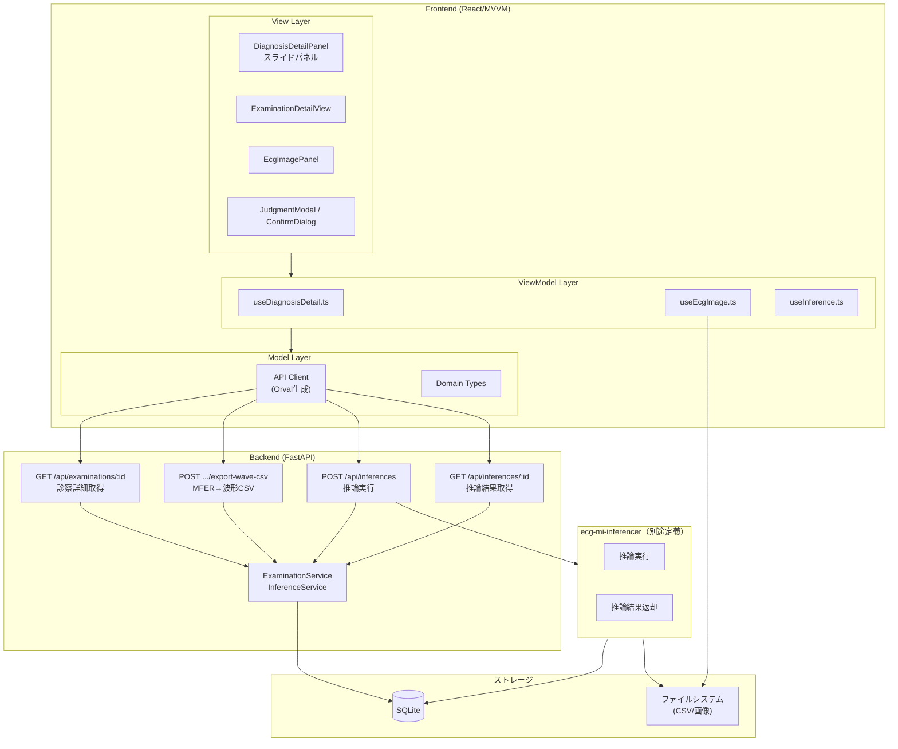

# 要件定義書: 診察詳細表示機能 (diagnosis-viewer)

## はじめに

本ドキュメントは、ECG心筋梗塞リスク推論システムにおける診察詳細表示機能の要件を定義する。
本機能は、診察一覧と**同一画面**上で、右からスライドインするパネル内に患者情報・心電図・診察メタ情報・推論（判定）を統合表示するフロントエンド機能である。別ルートの全画面詳細ページは用いない。

**責務境界:**
- **diagnosis-viewer（本機能）**: パネル内コンテンツ（`ExaminationDetailView`）、患者情報表示、心電図可視化、診察情報の折りたたみ表示、判定モーダルでの推論結果表示・クリップボードコピー、推論実行、（利用者操作に応じた）MFER 再読込による波形 CSV の再生成要求
- **diagnosis-list**: 診察行選択、スライドパネル（`DiagnosisDetailPanel`）の開閉、`?detail=` クエリとの同期、レガシー URL `/diagnoses/:id` からのリダイレクト
- **ecg-mi-inferencer（別途定義）**: 心電図波形解析、心筋梗塞リスク推論実行、推論結果の返却
- **file-importer**: 診察データ・患者データのDB登録（本機能のデータソース）
- **バックエンド（診察 API）**: `mfer_tools.extract_mfer_data` / `save_wave_csv` により MFER から波形 CSV を `data/waves/{診察ID}.csv` に出力し、`csv_file_path` を更新（詳細画面のボタンから `POST` で起動）

**関連ユースケース:**
- UC-4: システムユーザーは診察データを選択し、結果・患者データ・心電図を参照できる
- UC-4-extend: システムはシステムユーザーの診察データ選択時に、心筋梗塞推論を実行する
- Core Capability 5: 統合結果表示（患者情報・心電図・推論結果を一画面で確認）

**技術選定:** React（MVVMアーキテクチャ）、TanStack Query（サーバー状態管理）、Orval（API型定義）、バックエンドで生成した心電図波形画像の表示

## 要件一覧

### 要件1: 診察詳細の取得と表示

**目的:** 医療従事者として、選択した診察の詳細情報を確認したい。
これにより、診察に紐づく全ての情報を一括して把握できる。

#### 受け入れ基準

1. When 診察一覧で診察が選択される, 診察詳細表示機能 shall 診察UUIDをクエリパラメータ **`detail`**（例: `/diagnoses?detail=<UUID>&…`）として受け取る
2. When レガシーパス `/diagnoses/:id` にアクセスする, フロントエンド shall 同一クエリへリダイレクトする（`/diagnoses?detail=<id>`）
3. When パネル内で診察詳細を表示する, 診察詳細表示機能 shall バックエンドAPIから診察データを取得する
4. When データ取得中, 診察詳細表示機能 shall ローディングインジケーターを表示する
5. When データ取得に失敗した場合, 診察詳細表示機能 shall エラーメッセージを表示する
6. When 診察データが存在しない場合, 診察詳細表示機能 shall 「診察データが見つかりません」というメッセージを表示する

### 要件2: 患者情報の表示

**目的:** 医療従事者として、診察に紐づく患者情報を確認したい。
これにより、患者の基本情報を把握し、診断判断の参考とすることができる。

#### 受け入れ基準

1. 診察詳細表示機能 shall 以下の患者情報を表示する：患者ID（外部ID）、患者氏名、生年月日、性別（年齢の別表示は任意）
2. 診察詳細表示機能 shall 患者情報をパネル内容の**最上段**に表示する
3. 診察詳細表示機能 shall 各項目を**横一列**（フレックス行、狭幅時は横スクロール可）に配置する
4. 診察詳細表示機能 shall パネル内ではセクション見出しラベル（例:「患者情報」）を付けない
5. 診察詳細表示機能 shall パネル内では白カード枠・ドロップシャドウ等の「グループ枠」を付けず、背景に馴染むフラット表示とする

### 要件3: 診察情報の表示

**目的:** 医療従事者として、診察の基本情報を確認したい。
これにより、検査日時や関連情報を把握できる。

#### 受け入れ基準

1. 診察詳細表示機能 shall 以下の診察情報を表示する：検査日時、診察UUID、登録日時、MFER パス、波形 CSV パス
2. 診察詳細表示機能 shall 診察情報ブロックを**心電図波形の下**に配置する（患者情報・心電図の後）
3. 診察詳細表示機能 shall 診察情報を **`<details>` による折りたたみ**で提供し、**初期状態は閉じた状態**とする。サマリー文言は「詳細」等の短い開閉指示とする
4. 診察詳細表示機能 shall 折りたたみ内に「MFERから波形CSVを出力」操作を含めてよい
5. 診察詳細表示機能 shall 検査日時を「YYYY-MM-DD HH:mm:ss」形式で表示する
6. 診察詳細表示機能 shall 診察情報エリアにもパネル用のカード枠を付けない

### 要件4: 心電図波形の可視化表示

**目的:** 医療従事者として、心電図波形データを視覚的に確認したい。
これにより、心電図のパターンを直接確認し、推論結果と照合できる。

#### 受け入れ基準

1. 診察詳細表示機能 shall 心電図波形データをグラフ形式で表示する
2. 診察詳細表示機能 shall バックエンドAPIでCSVファイルから心電図波形画像を生成し、ブラウザで表示する
3. 診察詳細表示機能 shall 12誘導心電図を全て表示する（I, II, III, aVR, aVL, aVF, V1-V6）
4. バックエンド（`ecg_service`）shall CSV に含まれる誘導列（`time` と標準誘導名の列）を読み取り、**6 行 × 2 列**のサブプロットで 1 枚の PNG としてプロットする。行の並びは（1行目: I・V1）（2行目: II・V2）（3行目: III・V3）（4–6行目: aVR・V4, aVL・V5, aVF・V6）。CSV に無い誘導は当該セルにプレースホルダ（欠測表示）とし、**単一トレースのみのレガシー CSV** は誘導 **II** として 1 セルに表示する。レイアウト変更時は ECG PNG キャッシュのバージョンキーを更新する
5. 診察詳細表示機能 shall 各誘導を縦方向に配置し、時系列データを横軸に表示する（バックエンド生成 PNG において各サブプロットの縦軸が振幅、横軸が時刻）
6. バックエンド生成 PNG のタイトルまたは付帯表示 shall サンプリングレート（Hz）を含め、診察詳細表示機能 shall サンプリングレート情報を利用者が把握できること
7. 診察詳細表示機能 shall 心電図データの読み込み中にローディングインジケーターを表示する
8. When 心電図データが存在しない場合, 診察詳細表示機能 shall 「心電図データがありません」というメッセージを表示する
9. 診察詳細表示機能 shall パネル本体では API 生成 PNG を **`` で静的表示**し、12誘導画像クリック時のみ全画面ビューアを開いて単誘導表示・誘導切替を提供する
10. 全画面ビューア shall **「+」「-」** のフローティング操作で拡大縮小を提供し、拡大時に見切れた領域はドラッグ（ポインター操作）またはスクロールで移動できる
11. 診察詳細表示機能 shall 全画面ビューアの単誘導 PNG を `GET /api/examinations/{id}/ecg-image?lead=<lead>` で取得する（`lead` は標準12誘導名）
12. バックエンド shall 単誘導 PNG 生成時に高解像度設定を適用してよい（12誘導全体表示と単誘導拡大表示で異なる DPI 設定を許容する）
13. バックエンド生成 PNG shall 心電図用紙スケール（25mm/s, 10mm/mV 相当）に対応するグリッドを描画する（時間: 小マス0.04秒・大マス0.20秒、電位: 小マス0.1mV・大マス0.5mV）
14. バックエンド生成 PNG shall 標準校正波（1mV・0.2秒の矩形パルス）を描画する
    - **12誘導一覧 PNG** では、単誘導（拡大）PNG と**同一の規則**で、**列ごと**（左列: 肢体誘導 I–aVF、右列: 胸誘導 V1–V6）に縦軸範囲を決定し、大マス 0.5mV（500µV）境界に合わせて `set_ylim` した**後**に各パネルへ校正波を描画する。matplotlib の自動スケールのみとせず、振幅が小さいデータでも一覧表示で校正波が欠損しないこと
15. 診察詳細表示機能 shall 軸の目盛り数字を表示しない（グリッド線は表示可）
16. 診察詳細表示機能 shall 心電図表示エリアにセクション見出しラベル（例:「心電図波形」）を付けない。画像まわりの枠線は付けない（フラット表示）

### 要件4-拡張: MFER から波形 CSV の再出力

**目的:** 医療従事者として、保存されている MFER を再度読み込み、心電図表示用の波形 CSV を取り直したい。
これにより、インポート後に CSV を再生成した場合でも最新の波形に基づく画像表示に更新できる。

#### 受け入れ基準

1. 診察詳細表示機能 shall **折りたたみ「詳細」内**に「MFERから波形CSVを出力」操作（ボタン等）を提供する
2. When 当該操作が実行される, 診察詳細表示機能 shall 認可付きで `POST /api/examinations/{examination_id}/export-wave-csv` を呼び出す
3. バックエンド shall 解決した `.mwf` に対し `mfer_tools.extract_mfer_data` と `save_wave_csv` で波形 CSV を書き出し、診察の `csv_file_path` をそのパスに更新する
4. When エクスポートが成功する, 診察詳細表示機能 shall 診察詳細の再取得と心電図画像の再取得（キャッシュバイパス）を行い、更新後の波形を表示する
5. When MFER が見つからない・読み込みに失敗する, 診察詳細表示機能 shall エラーメッセージを表示する

### 要件5: 推論結果の表示（判定モーダル）

**目的:** 医療従事者として、AI による心筋梗塞リスク推論結果をモーダルで確認したい。
これにより、本筋の閲覧（患者・心電図）を邪魔せず、必要時に判定内容に集中できる。

#### 受け入れ基準

1. 診察詳細表示機能 shall **パネル本文に推論結果の常設カードを置かない**（一覧・心電図・詳細折りたたみのみをフラットに表示する）
2. 診察詳細表示機能 shall 画面右下に固定配置の **「判定」** ボタン（FAB）を提供する
3. When 「判定」が押される, 診察詳細表示機能 shall **モーダルダイアログ**を開き、その中で推論ステータス・結果・操作を扱う
4. When 推論ステータスが「完了」かつリスクレベルが **「高」または「中」**, モーダル shall 陽性向け表示とする：薄いピンクの円背景＋警告アイコン、見出し「**リスクあり（陽性）**」、説明文「心不全のリスクが検出されました。医師による確認をお願いします。」
5. When 推論ステータスが「完了」かつリスクレベルが **「低」**, モーダル shall 陰性向け表示とする：薄い緑の円背景＋成功アイコン、見出し「**リスク低（陰性）**」、説明文「目立ったリスクは検出されませんでした。結果は参考情報です。」
6. When 推論ステータスが「完了」で上記以外のレベル表現の場合, モーダル shall リスクスコア・レベル・実行日時を短文で表示する
7. モーダルのフッター shall **「判定結果をクリップボードにコピー」**（アウトラインsecondary、コピーアイコン付き）と **「閉じる」**（プライマリ青）を右寄せで並べる（完了時かつエラーでない場合はコピー可能）
8. クリップボード内容 shall 少なくとも診察ID・ステータス・リスクスコア・リスクレベル・推論実行日時を含むプレーンテキストとする
9. When 推論ステータスが「実行中」または API 送信中, モーダル shall スピナーと待機文言を表示する
10. When エラーが発生した場合, モーダル shall エラー内容を表示する
11. モーダル shall 背景クリック・Escape・「閉じる」で閉じられる。子モーダル（確認ダイアログ）表示中はパネル全体の Escape 閉じを抑制する（`data-prevent-panel-escape` 等）

### 要件6: 推論実行機能

**目的:** 医療従事者として、未実行の診察に対して心筋梗塞リスク推論を実行したい。
これにより、AIによるリスク評価を得て診断判断の参考とすることができる。

#### 受け入れ基準

1. When 推論ステータスが「未実行」または「エラー」で判定モーダルを開いた場合, 診察詳細表示機能 shall モーダル内に **「推論を実行」** ボタンを表示する（パネル本文には置かない）
2. When 「推論を実行」がクリックされる, 診察詳細表示機能 shall **確認ダイアログ**（キャンセル/実行）を重ねて表示する
3. When 確認で実行が選択される, 診察詳細表示機能 shall バックエンド `POST /api/inferences`（診察UUID）を呼び出す
4. When 推論実行が開始される, 診察詳細表示機能 shall モーダル内表示を「実行中」に切り替える
5. 診察詳細表示機能 shall 推論実行中は再実行ボタンを無効化する
6. When 推論が完了する, 診察詳細表示機能 shall モーダル内の表示を結果画面（要件5）に更新する
7. When 推論がエラー終了する, 診察詳細表示機能 shall モーダル内にエラーメッセージを表示する
8. 診察詳細表示機能 shall 推論ステータスが「実行中」の間、5 秒間隔でステータスをポーリングして更新する

### 要件7: データ自動更新

**目的:** 医療従事者として、推論実行中に最新のステータスを自動的に確認したい。
これにより、推論完了を待たずに最新情報を把握できる。

#### 受け入れ基準

1. When 推論ステータスが「実行中」の場合, 診察詳細表示機能 shall 自動的にステータスをポーリングする（本番の長時間推論では数秒間隔が望ましい。開発用モック等、短時間で完了するバックエンドでは 1 秒未満の間隔でもよい）
2. When 推論ステータスが「完了」または「エラー」に変化した場合, 診察詳細表示機能 shall ポーリングを停止する
3. When 画面がフォーカス状態に戻る（タブ切り替え後等）, 診察詳細表示機能 shall 診察データを再取得する

### 要件8: パネル表示・ナビゲーション

**目的:** 医療従事者として、診察詳細を一覧から離れずに開閉したい。
これにより、コンテキストを保ったまま複数診察を比較しやすくする。

#### 受け入れ基準

1. 診察詳細表示機能 shall **パネル見出し「診察詳細」や右上の明示的な × ボタンを表示しない**（情報密度と視覚ノイズの低減）
2. 診察詳細表示機能 shall パネルを閉じる手段として **背景オーバーレイのクリック** と **Escape**（子ダイアログ未表示時）を提供する
3. 診察詳細表示機能 shall パネル幅を**ビューポート幅の約 2/3**とする（狭い画面では所定ブレークポイントで全幅に切り替えてよい）
4. 診察詳細表示機能 shall パネル開閉時にスライドアニメーションを用いてよい。閉じ完了後に URL から `detail` を除去する
5. 診察詳細表示機能 shall ブラウザの戻る/進むと `detail` クエリの有無が同期する（共有・ブックマーク可能）

---

## 非機能要件

### パフォーマンス

- 診察詳細表示機能 shall 診察データ取得から表示までを2秒以内に完了する
- 診察詳細表示機能 shall 心電図データの読み込みから表示までを3秒以内に完了する
- 診察詳細表示機能 shall 推論結果の表示を1秒以内に完了する

### ユーザビリティ

- 診察詳細表示機能 shall 心電図波形が読みやすいように適切な色と線の太さを使用する（バックエンド PNG 生成）
- 診察詳細表示機能 shall パネル内では**カード枠によるセクション区切りを使わず**、縦方向の余白（gap）と折りたたみで情報を整理する
- 診察詳細表示機能 shall 重要なリスク情報は**判定モーダル**で見出し・アイコン・配色により強調する

### セキュリティ

- 診察詳細表示機能 shall 認可トークン（JWT）をリクエストヘッダーに含めてAPIを呼び出す
- 診察詳細表示機能 shall 認可トークンが無効な場合、ログイン画面へリダイレクトする
- 診察詳細表示機能 shall 患者情報を含むログを出力しない

---

## データモデル概要

### 診察詳細APIレスポンス

| フィールド | 型 | 説明 |
|------------|------|------|
| `id` | UUID | 診察ID |
| `exam_date` | DateTime | 検査日時 |
| `mfer_file_path` | String \| null | MFERファイルのパス（未設定時は null） |
| `created_at` | DateTime | 登録日時 |
| `patient` | Object | 患者情報 |
| `patient.id` | UUID | 患者ID |
| `patient.external_id` | String | 患者外部ID（MFER内のID） |
| `patient.name` | String | 患者氏名 |
| `patient.gender` | String | 性別（男性/女性） |
| `patient.birth_date` | Date | 生年月日 |
| `inference` | Object | 推論結果（null許容） |
| `inference.status` | String | 推論ステータス（未実行/実行中/完了/エラー） |
| `inference.risk_score` | Float | リスクスコア（0.0-100.0） |
| `inference.risk_level` | String | リスクレベル（低/中/高） |
| `inference.executed_at` | DateTime | 推論実行日時 |
| `csv_file_path` | String | CSVファイルのパス（心電図波形データ。エクスポート後は `data/waves/{診察ID}.csv` を指す） |

### 波形 CSV エクスポート API

| 項目 | 内容 |
|------|------|
| メソッド・パス | `POST /api/examinations/{examination_id}/export-wave-csv` |
| 認可 | JWT（Bearer）必須 |
| 成功時レスポンス | 診察オブジェクトの一部（更新後の `csv_file_path` 等を含む） |
| 失敗時 | MFER 未検出・`mfer_tools` エラー等は 4xx/5xx と `detail` メッセージ |

### 推論実行APIリクエスト

| パラメータ | 型 | 必須 | 説明 |
|------------|------|------|------|
| `examination_id` | UUID | ✓ | 診察ID |

### 推論実行APIレスポンス

| フィールド | 型 | 説明 |
|------------|------|------|
| `status` | String | 推論ステータス（実行中/完了/エラー） |
| `examination_id` | UUID | 診察ID |

---

## アーキテクチャ境界図


```mermaid
flowchart TB
    subgraph FE["Frontend (React/MVVM)"]
        direction TB
        subgraph View["View Layer"]
            PANEL["DiagnosisDetailPanel<br/>スライドパネル"]
            DV["ExaminationDetailView"]
            ECG["EcgImagePanel"]
            JUD["JudgmentModal / ConfirmDialog"]
        end

        subgraph VM["ViewModel Layer"]
            UDV["useDiagnosisDetail.ts"]
            UECG["useEcgImage.ts"]
            UINF["useInference.ts"]
        end

        subgraph Model["Model Layer"]
            API["API Client<br/>(Orval生成)"]
            DT["Domain Types"]
        end

        View --> VM
        VM --> Model
    end

    subgraph BE["Backend (FastAPI)"]
        EP1["GET /api/examinations/:id<br/>診察詳細取得"]
        EP1b["POST .../export-wave-csv<br/>MFER→波形CSV"]
        EP2["POST /api/inferences<br/>推論実行"]
        EP3["GET /api/inferences/:id<br/>推論結果取得"]
        ES["ExaminationService<br/>InferenceService"]
    end

    subgraph INF["ecg-mi-inferencer（別途定義）"]
        RUN["推論実行"]
        RESULT["推論結果返却"]
    end

    subgraph Storage["ストレージ"]
        DB[(SQLite)]
        FS["ファイルシステム<br/>(CSV/画像)"]
    end

    API --> EP1
    API --> EP1b
    API --> EP2
    API --> EP3
    EP1 --> ES
    EP1b --> ES
    EP2 --> ES
    EP3 --> ES
    ES --> DB
    EP2 --> INF
    INF --> DB
    INF --> FS
    UECG --> FS
```

---

## UI構成（スライドパネル＋判定モーダル）

```text
[診察一覧（左・約1/3幅）]  │  [詳細パネル（右・ビューポート幅の約2/3）        ]
  フィルター・テーブル      │  （見出し「診察詳細」・× なし）
                           │  患者ID / 氏名 / 性別 / 生年月日 … 横一列（枠なし）
                           │  12誘導 PNG（6行×2列相当・img・枠なし）
                           │  ▶ 詳細  （折りたたみ・初期閉）
                           │      └ 検査日時・診察ID・パス・[MFERから波形CSVを出力]
                           │                                    [ 判定 ] ← FAB 右下
                           │
                           │  （「判定」押下）→ モーダル
                           │    ・完了×陽性: 警告アイコン＋「リスクあり（陽性）」＋説明文
                           │    ・完了×陰性: 成功アイコン＋「リスク低（陰性）」＋説明文
                           │    ・未実行: 「推論を実行」→ 確認ダイアログ
                           │    フッター: [判定結果をクリップボードにコピー] [閉じる]
```

---

## 用語定義

| 用語 | 定義 |
|------|------|
| 診察詳細 | 1回の心電図検査に対応する全ての情報（患者情報、診察情報、心電図、推論結果） |
| 心電図波形 | CSVファイルに保存された時系列の心電図データ（詳細画面から MFER 再読込で CSV を再生成可能） |
| 12誘導 | 心電図の標準的な12個の測定位置（I, II, III, aVR, aVL, aVF, V1-V6） |
| 推論結果 | AIによる心筋梗塞リスク推論の出力（リスクスコア、リスクレベル） |
| リスクスコア | 0-100%の数値で表される心筋梗塞リスクの程度 |
| リスクレベル | リスクスコアに基づく分類（低/中/高） |
| ecg-mi-inferencer | 心電図波形を解析し心筋梗塞リスクを推論するサービス |

---

**ステータス:** 実装追随更新済み（スライドパネル・判定モーダル・単誘導全画面ビューア・6×2 誘導 PNG・フラット UI）
**作成日:** 2025-12-07
**最終更新:** 2026-04-08（12誘導一覧の列別縦軸確定後の校正波）

