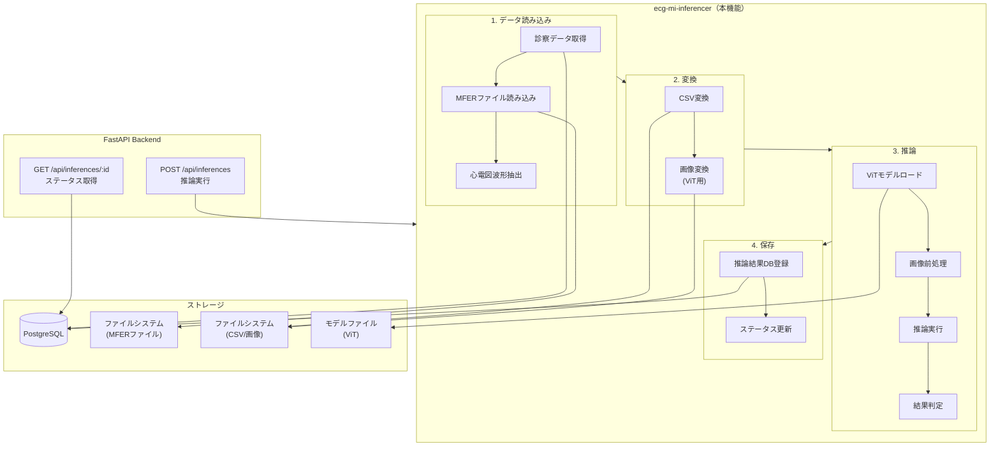
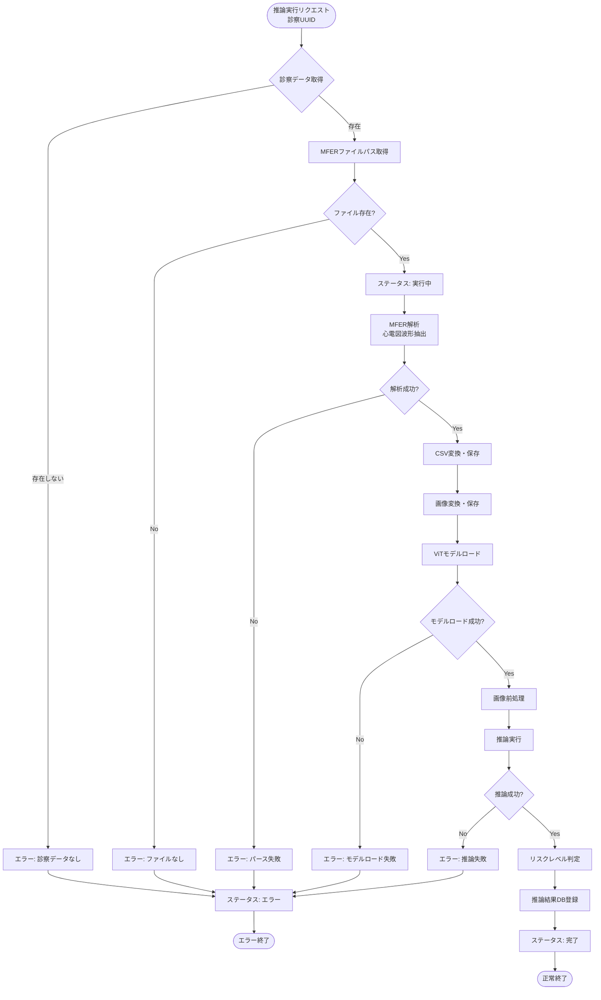

# 要件定義書: 心筋梗塞リスク推論機能 (ecg-mi-inferencer)

## はじめに

本ドキュメントは、ECG心筋梗塞リスク推論システムにおける心筋梗塞リスク推論機能の要件を定義する。
本機能は、診察UUIDを受け取り、MFERファイルから心電図波形データを読み込み、Vision Transformerモデルを用いて
心筋梗塞リスクを推論するバックエンドサービスである。

**責務境界:**
- **ecg-mi-inferencer（本機能）**: MFERファイルからの心電図波形読み込み、CSV変換、画像変換、AI推論実行、推論結果のDB登録
- **file-importer**: 診察データのDB登録、MFERファイルパスの紐付け（本機能のデータソース）
- **diagnosis-viewer**: 推論実行のトリガー、推論結果の表示

**関連ユースケース:**
- UC-4-extend: システムはシステムユーザーの診察データ選択時に、心筋梗塞推論を実行する
- Core Capability 2: 心電図データ変換パイプライン（MFER → CSV → 画像）
- Core Capability 3: AI心筋梗塞リスク推論

**技術選定:** Python 3.14+, PyTorch, Vision Transformer, FastAPI, SQLAlchemy

## 要件一覧

### 要件1: 推論実行の受け付け

**目的:** システムとして、診察UUIDを受け取り推論処理を開始したい。
これにより、診察詳細画面から推論実行リクエストを処理できる。

#### 受け入れ基準

1. When 診察UUIDを受け取る, ecg-mi-inferencer shall 診察データをデータベースから取得する
2. If 診察データが存在しない場合, then ecg-mi-inferencer shall エラーを返す
3. ecg-mi-inferencer shall 診察レコードの推論ステータスを「実行中」に更新する
4. ecg-mi-inferencer shall 診察データからMFERファイルパスを取得する
5. ecg-mi-inferencer shall FastAPIエンドポイント（POST /api/inferences）として実装する
6. ecg-mi-inferencer shall 推論実行を非同期で処理する（バックグラウンドジョブ）
7. ecg-mi-inferencer shall 推論実行IDを返す（ステータス確認用）

### 要件2: MFERファイルからの心電図波形読み込み

**目的:** システムとして、MFERファイルから心電図波形データを抽出したい。
これにより、Vision Transformerモデルへの入力データを準備できる。

#### 受け入れ基準

1. When MFERファイルパスが取得される, ecg-mi-inferencer shall MFERファイルの存在を確認する
2. If MFERファイルが存在しない場合, then ecg-mi-inferencer shall エラーを返し推論ステータスを「エラー」に更新する
3. ecg-mi-inferencer shall MFER形式のバイナリデータをパースする
4. ecg-mi-inferencer shall 12誘導心電図の波形データ（時系列データ）を抽出する
5. ecg-mi-inferencer shall サンプリングレート情報を取得する
6. ecg-mi-inferencer shall 心電図データの欠損や異常値を検出する
7. If 必須データ（12誘導の波形データ）が欠落している場合, then ecg-mi-inferencer shall エラーを返す

### 要件3: 心電図データのCSV変換

**目的:** システムとして、抽出した心電図波形データをCSV形式で保存したい。
これにより、後続の画像変換や外部ツールでの分析を可能にする。

#### 受け入れ基準

1. When 心電図波形データが抽出される, ecg-mi-inferencer shall データをCSV形式に変換する
2. ecg-mi-inferencer shall CSVファイルを診察UUID名で保存する（例: `{exam_uuid}.csv`）
3. ecg-mi-inferencer shall CSVの列として各リード（I, II, III, aVR, aVL, aVF, V1-V6）を含む
4. ecg-mi-inferencer shall CSVの行としてサンプリングポイントを時系列で含む
5. ecg-mi-inferencer shall CSVヘッダーにサンプリングレート情報をコメントとして含む
6. ecg-mi-inferencer shall CSVファイルの保存先を環境変数 `ECG_CSV_FOLDER` で設定可能とする
7. ecg-mi-inferencer shall CSVファイルのパスを診察レコードに記録する
8. If 既にCSVファイルが存在する場合, then ecg-mi-inferencer shall 既存ファイルを上書きする

### 要件4: Vision Transformer用画像変換

**目的:** システムとして、心電図データをVision Transformer推論用の画像に変換したい。
これにより、AIモデルへの入力データを準備する。

#### 受け入れ基準

1. When CSVデータが生成される, ecg-mi-inferencer shall 心電図波形を画像として描画する
2. ecg-mi-inferencer shall 12誘導心電図を1枚の画像にレイアウトする
3. ecg-mi-inferencer shall 画像サイズを環境変数 `ECG_IMAGE_SIZE` で設定可能とする（デフォルト: 224x224）
4. ecg-mi-inferencer shall 画像形式をPNGとする
5. ecg-mi-inferencer shall 画像ファイルを診察UUID名で保存する（例: `{exam_uuid}.png`）
6. ecg-mi-inferencer shall 画像ファイルの保存先を環境変数 `ECG_IMAGE_FOLDER` で設定可能とする
7. ecg-mi-inferencer shall 画像ファイルのパスを診察レコードに記録する
8. ecg-mi-inferencer shall 画像の前処理（正規化、リサンプリング等）を実行する
9. If 既に画像ファイルが存在する場合, then ecg-mi-inferencer shall 既存ファイルを上書きする

### 要件5: AI推論実行

**目的:** システムとして、Vision Transformerモデルを用いて心筋梗塞リスクを推論したい。
これにより、客観的なリスク評価を提供できる。

#### 受け入れ基準

1. When 画像データが生成される, ecg-mi-inferencer shall Vision Transformerモデルをロードする
2. ecg-mi-inferencer shall モデルファイルのパスを環境変数 `ECG_MODEL_PATH` で設定可能とする
3. ecg-mi-inferencer shall 画像データをモデルの入力形式に変換する（前処理）
4. ecg-mi-inferencer shall モデルに画像を入力して推論を実行する
5. ecg-mi-inferencer shall 推論結果からリスクスコア（0.0-100.0）を取得する
6. ecg-mi-inferencer shall リスクスコアに基づいてリスクレベルを判定する（低: 0-40、中: 41-70、高: 71-100）
7. If モデルファイルが存在しない場合, then ecg-mi-inferencer shall エラーを返す
8. If 推論実行中にエラーが発生した場合, then ecg-mi-inferencer shall エラーログを出力し推論ステータスを「エラー」に更新する

### 要件6: 推論結果のDB登録

**目的:** システムとして、推論結果をデータベースに登録したい。
これにより、診察詳細画面で推論結果を表示できる。

#### 受け入れ基準

1. When 推論が正常に完了する, ecg-mi-inferencer shall 推論結果をデータベースに登録する
2. ecg-mi-inferencer shall 以下の情報を登録する：リスクスコア、リスクレベル、推論実行日時、CSVファイルパス、画像ファイルパス
3. ecg-mi-inferencer shall 診察レコードの推論ステータスを「完了」に更新する
4. ecg-mi-inferencer shall 推論結果の登録を単一トランザクション内で実行する
5. If DB登録が失敗した場合, then ecg-mi-inferencer shall トランザクションをロールバックし推論ステータスを「エラー」に更新する
6. ecg-mi-inferencer shall 推論実行日時を記録する

### 要件7: 推論ステータスの取得

**目的:** システムとして、推論実行のステータスを取得したい。
これにより、診察詳細画面で推論進行状況を表示できる。

#### 受け入れ基準

1. ecg-mi-inferencer shall 推論実行IDまたは診察UUIDでステータスを取得できるエンドポイント（GET /api/inferences/:id）を提供する
2. ecg-mi-inferencer shall 推論ステータス（未実行/実行中/完了/エラー）を返す
3. When 推論ステータスが「完了」の場合, ecg-mi-inferencer shall 推論結果（リスクスコア、リスクレベル）も返す
4. When 推論ステータスが「エラー」の場合, ecg-mi-inferencer shall エラーメッセージも返す

### 要件8: エラーハンドリング

**目的:** システムとして、処理中のエラーを適切に処理したい。
これにより、エラー原因の特定と復旧を容易にする。

#### 受け入れ基準

1. ecg-mi-inferencer shall エラー種別を以下に分類する：ファイルエラー、パースエラー、変換エラー、推論エラー、DBエラー
2. When エラーが発生する, ecg-mi-inferencer shall エラー種別とメッセージをログに出力する
3. ecg-mi-inferencer shall エラー時に診察レコードの推論ステータスを「エラー」に更新する
4. ecg-mi-inferencer shall エラー詳細（スタックトレース）をDEBUGレベルでログ出力する
5. ecg-mi-inferencer shall 部分的に生成されたファイル（CSV、画像）をクリーンアップする（オプション）

### 要件9: リソース管理

**目的:** システム管理者として、推論処理のリソース使用を制御したい。
これにより、システムの安定性とパフォーマンスを維持できる。

#### 受け入れ基準

1. ecg-mi-inferencer shall 同時実行数の上限を環境変数 `ECG_MAX_CONCURRENT` で設定可能とする（デフォルト: 3）
2. ecg-mi-inferencer shall 同時実行数が上限に達した場合、新規推論リクエストをキューに追加する
3. ecg-mi-inferencer shall 推論処理のタイムアウトを環境変数 `ECG_INFERENCE_TIMEOUT` で設定可能とする（デフォルト: 300秒）
4. When 推論処理がタイムアウトした場合, then ecg-mi-inferencer shall 処理を中断しエラーを返す
5. ecg-mi-inferencer shall GPUメモリの使用状況を監視する（GPU使用時）

---

## 非機能要件

### パフォーマンス

- ecg-mi-inferencer shall 1件の推論処理を5分以内に完了する
- ecg-mi-inferencer shall メモリ使用量を2GB以下に抑える（モデルサイズを考慮）
- ecg-mi-inferencer shall GPU使用時はGPUメモリを効率的に利用する

### 信頼性

- ecg-mi-inferencer shall 推論処理の冪等性を保証する（同一診察UUIDで複数回実行しても結果が同じ）
- ecg-mi-inferencer shall 部分的なデータが残らないようトランザクション管理を行う
- ecg-mi-inferencer shall 推論処理中のシステムクラッシュに対応する（再実行可能）

### セキュリティ

- ecg-mi-inferencer shall 患者情報を含むログは出力しない（診察UUIDのみ可）
- ecg-mi-inferencer shall 生成ファイルのアクセス権限を適切に設定する

---

## 用語定義

| 用語 | 定義 |
|------|------|
| MFER | Medical waveform Format Encoding Rules、医療波形データの標準フォーマット |
| 心電図波形 | MFERファイルに記録された時系列の心電図データ |
| 12誘導 | 心電図の標準的な12個の測定位置（I, II, III, aVR, aVL, aVF, V1-V6） |
| Vision Transformer | 画像認識用のAIモデルアーキテクチャ |
| リスクスコア | 0.0-100.0の数値で表される心筋梗塞リスクの程度 |
| リスクレベル | リスクスコアに基づく分類（低: 0-40、中: 41-70、高: 71-100） |
| 推論ステータス | 推論実行の状態（未実行/実行中/完了/エラー） |

---

## 環境変数一覧

| 変数名 | 必須 | デフォルト | 説明 |
|--------|------|-----------|------|
| `ECG_CSV_FOLDER` | - | `./data/csv` | CSV変換ファイルの保存先 |
| `ECG_IMAGE_FOLDER` | - | `./data/images` | 画像変換ファイルの保存先 |
| `ECG_IMAGE_SIZE` | - | `224` | 生成画像のサイズ（正方形、ピクセル） |
| `ECG_MODEL_PATH` | ✓ | - | Vision Transformerモデルファイルのパス |
| `ECG_MAX_CONCURRENT` | - | `3` | 同時推論実行数の上限 |
| `ECG_INFERENCE_TIMEOUT` | - | `300` | 推論処理のタイムアウト（秒） |
| `DATABASE_URL` | ✓ | - | データベース接続文字列 |

---

## アーキテクチャ境界図

---

## 処理フロー

---

**ステータス:** レビュー待ち
**作成日:** 2025-12-07
**最終更新:** 2025-12-07

