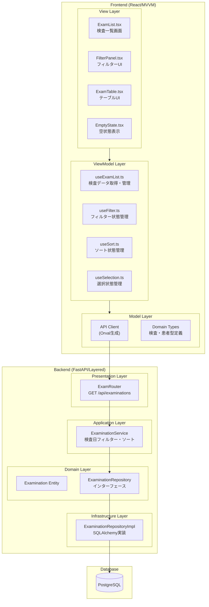
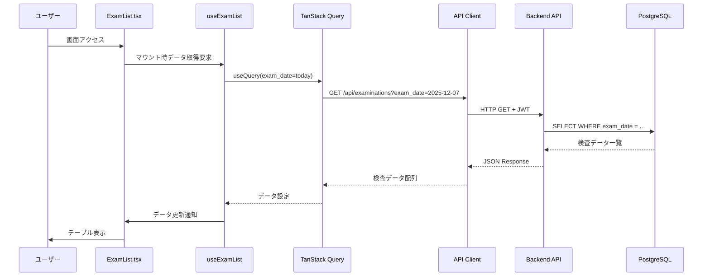
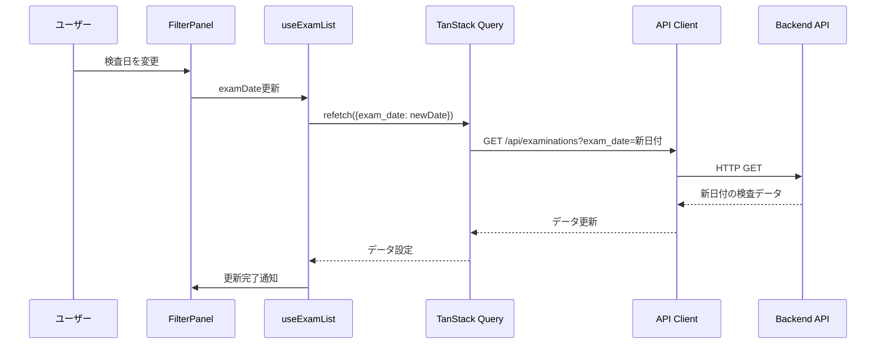
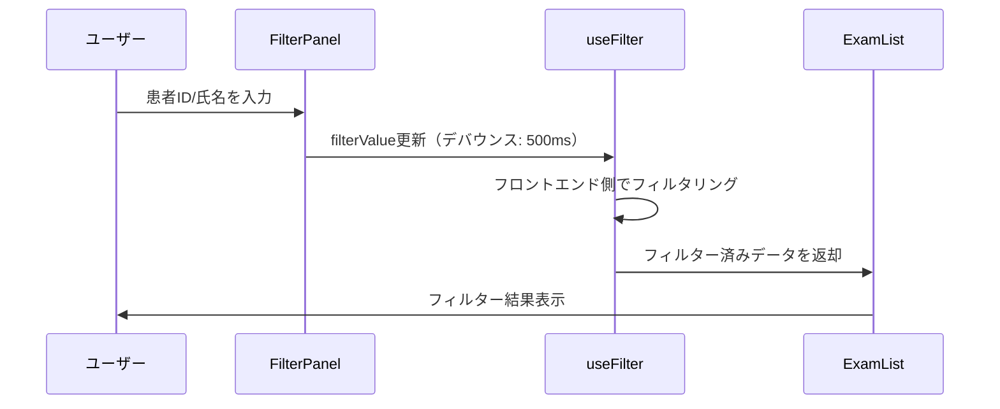
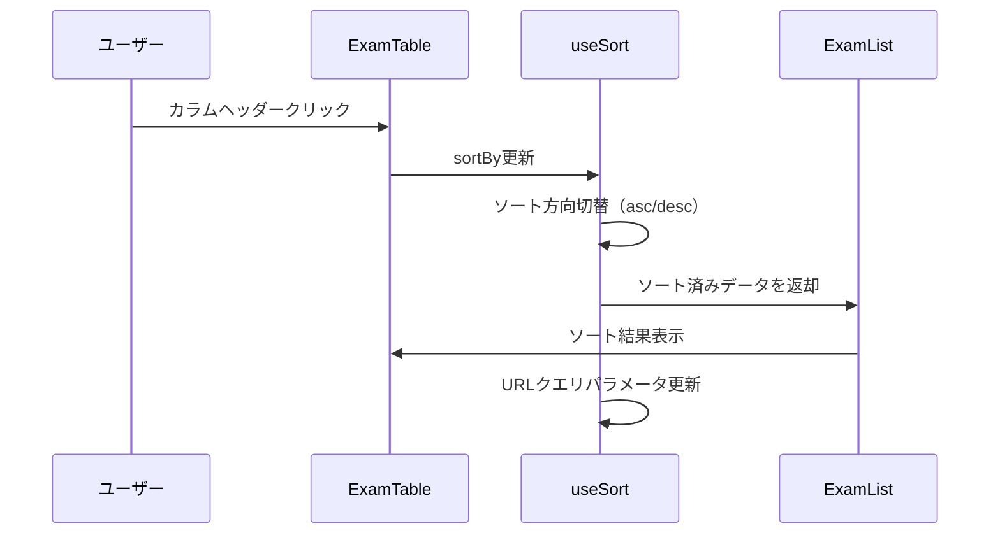
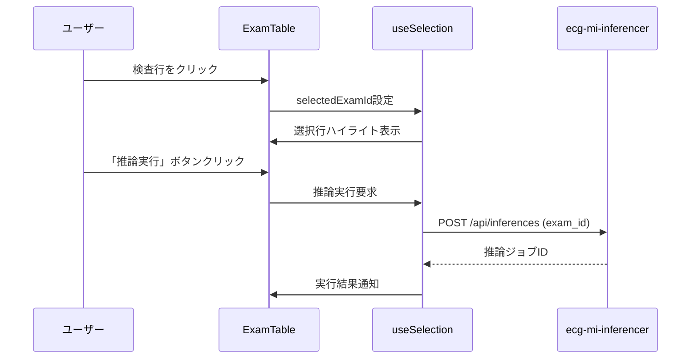
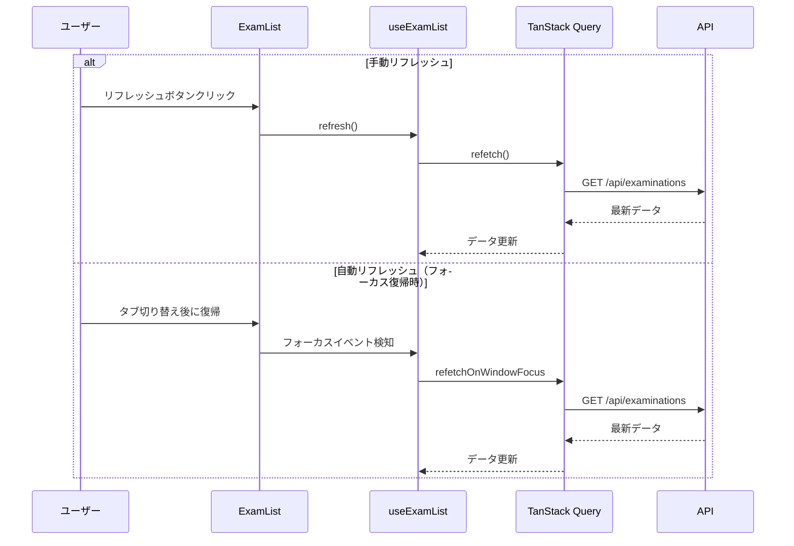

# 設計ドキュメント: 検査一覧機能 (exam-list)

## 概要

**目的**: 本機能は、フロントエンドとバックエンドの組み合わせにより実現される機能であり、
システムユーザー（医療従事者）がDB登録済みの検査データを一覧表示し、患者情報でフィルタリングして検索できる。

**ユーザー**: 医療従事者（システムユーザー）

**特徴**: 検査日フィルター（バックエンド）、患者ID/氏名フィルター（フロントエンド）、
ソート機能、検査選択、データリフレッシュを実現する。

### ゴール

- 検査データの一覧表示（テーブル形式）
- 検査日フィルター（バックエンドAPI経由）
- 患者ID・患者氏名フィルター（フロントエンド側で実装）
- 複数カラムでのソート機能
- 検査選択と詳細画面への遷移
- 推論実行機能
- データリフレッシュ（手動・自動）

### 非ゴール

- 検査データのDB登録（file-importerの責務）
- 心不全リスク推論実行（ecg-mi-inferencerの責務）
- 検査詳細の表示（exam-viewerの責務）
- ページネーション（非提供）

## アーキテクチャ

### アーキテクチャパターン

**フロントエンド**: MVVMアーキテクチャ
**バックエンド**: Layered Architecture（DDD準拠）

**ドメイン境界**:
- **フロントエンド**:
  - `features/exams/` に検査一覧機能（MVVM構成）
  - `features/exams/components/` にView層コンポーネント
  - `features/exams/hooks/` にViewModel層（カスタムフック）
  - `api/` にOrval生成のAPIクライアント（Model層）
- **バックエンド**:
  - `app/api/v1/examinations.py` にAPIエンドポイント（Presentation層）
  - `app/services/examination_service.py` に検査サービス（Application層）
  - `app/domain/examination/` にドメインモデル（Domain層）
  - `app/infrastructure/repositories/` にRepository実装（Infrastructure層）

**ステアリング準拠**:
- DDD原則に従い、ドメイン層は外部依存なし
- MVVMでView、ViewModel、Modelの責務分離
- Layered Architectureで責務分離

### システム境界図



### 技術スタック

| Layer | 選択技術 | 役割 | 備考 |
|-------|----------|------|------|
| Frontend Framework | React 18+ + TypeScript | UI フレームワーク | |
| 状態管理 | TanStack Query | サーバー状態管理 | キャッシュ・リフレッシュ |
| API型定義 | Orval | OpenAPIからTypeScript型生成 | |
| UIコンポーネント | React Components | カスタムコンポーネント | Storybook対応 |
| Backend Framework | FastAPI + Python 3.14+ | REST API | |
| Database ORM | SQLAlchemy | ORM | |
| Database | PostgreSQL 15+ | データベース | |

## システムフロー

### 検査一覧表示フロー



### フィルタリングフロー（検査日変更）



### フィルタリングフロー（患者ID/氏名 - フロントエンド）



### ソートフロー



### 検査選択・推論実行フロー



### データリフレッシュフロー



## コンポーネント設計

### フロントエンド

#### 1. ExamList.tsx（View層）

**責務**: 検査一覧画面の統合コンポーネント

**Props**: なし（ルーティング経由でアクセス）

**主要機能**:
- `useExamList` フックでデータ取得
- `FilterPanel` でフィルターUI表示
- `ExamTable` でテーブル表示
- `EmptyState` で空状態表示

```typescript
export const ExamList: React.FC = () => {
  const { exams, isLoading, error, refetch, lastUpdated } = useExamList();
  const { filteredExams } = useFilter(exams);
  const { sortedExams } = useSort(filteredExams);
  const { selectedExam, selectExam } = useSelection();

  // フォーカス復帰時の自動リフレッシュ処理

  return (
    <div>
      <FilterPanel />
      {isLoading ? <LoadingSpinner /> : null}
      {error ? <ErrorMessage error={error} /> : null}
      {sortedExams.length === 0 ? (
        <EmptyState message="該当する検査データがありません" />
      ) : (
        <ExamTable
          exams={sortedExams}
          selectedExam={selectedExam}
          onSelect={selectExam}
        />
      )}
      <LastUpdated timestamp={lastUpdated} />
    </div>
  );
};
```

#### 2. FilterPanel.tsx（View層）

**責務**: フィルターUIの表示と入力制御

**Props**:
- `examDate: Date` - 検査日（初期値: 当日）
- `onExamDateChange: (date: Date) => void`
- `patientId: string`
- `onPatientIdChange: (value: string) => void`
- `patientName: string`
- `onPatientNameChange: (value: string) => void`
- `onClear: () => void`
- `onRefresh: () => void`

**主要機能**:
- 検査日ピッカー（date picker）
- 患者ID入力フィールド
- 患者氏名入力フィールド
- クリアボタン
- リフレッシュボタン

#### 3. ExamTable.tsx（View層）

**責務**: 検査データテーブルの表示

**Props**:
- `exams: Exam[]` - 表示する検査データ配列
- `selectedExam: Exam | null` - 選択中の検査
- `onSelect: (exam: Exam) => void` - 選択ハンドラ
- `onSort: (column: SortColumn, order: SortOrder) => void` - ソートハンドラ

**主要機能**:
- 検査日時、患者ID、患者氏名、性別、年齢のカラム表示
- ソート可能カラム（クリックで昇順/降順切替）
- 行選択（クリックでハイライト）
- 選択時のアクションボタン表示（詳細表示、推論実行）

#### 4. useExamList.ts（ViewModel層）

**責務**: 検査データの取得・管理、TanStack Queryとの統合

**主要機能**:
- TanStack Queryによるサーバー状態管理
- 検査日パラメータに基づくAPI呼び出し
- データリフレッシュ（手動・自動）
- 最終更新日時の記録

```typescript
export const useExamList = (examDate: Date = new Date()) => {
  const queryClient = useQueryClient();

  const { data, isLoading, error, refetch } = useQuery({
    queryKey: ['exams', formatDate(examDate)],
    queryFn: () => examApi.getExaminations({
      exam_date: formatDate(examDate),
      sort_by: 'exam_date',
      sort_order: 'desc'
    }),
    staleTime: 30 * 1000, // 30秒
    refetchOnWindowFocus: true,
  });

  const lastUpdated = useMemo(() => new Date(), [data]);

  return {
    exams: data?.exams ?? [],
    isLoading,
    error,
    refetch,
    lastUpdated,
  };
};
```

#### 5. useFilter.ts（ViewModel層）

**責務**: フロントエンド側フィルター状態管理

**主要機能**:
- 患者ID・患者氏名フィルター状態管理
- デバウンス処理（500ms）
- フィルター適用ロジック

```typescript
export const useFilter = (
  exams: Exam[],
  patientId: string = '',
  patientName: string = ''
) => {
  const [debouncedPatientId] = useDebounce(patientId, 500);
  const [debouncedPatientName] = useDebounce(patientName, 500);

  const filteredExams = useMemo(() => {
    return exams.filter(exam => {
      const matchesPatientId = !debouncedPatientId ||
        exam.patient.external_id.includes(debouncedPatientId);
      const matchesPatientName = !debouncedPatientName ||
        exam.patient.name.includes(debouncedPatientName);
      return matchesPatientId && matchesPatientName;
    });
  }, [exams, debouncedPatientId, debouncedPatientName]);

  return { filteredExams };
};
```

#### 6. useSort.ts（ViewModel層）

**責務**: ソート状態管理

**主要機能**:
- ソートカラム・方向の状態管理
- URLクエリパラメータとの同期
- ソート適用ロジック

```typescript
export const useSort = (exams: Exam[]) => {
  const [searchParams, setSearchParams] = useSearchParams();

  const sortBy = (searchParams.get('sort_by') as SortColumn) ?? 'exam_date';
  const sortOrder = (searchParams.get('sort_order') as SortOrder) ?? 'desc';

  const handleSort = (column: SortColumn) => {
    const newOrder = sortBy === column && sortOrder === 'desc' ? 'asc' : 'desc';
    setSearchParams({
      sort_by: column,
      sort_order: newOrder,
    });
  };

  const sortedExams = useMemo(() => {
    return [...exams].sort((a, b) => {
      // ソートロジック
    });
  }, [exams, sortBy, sortOrder]);

  return { sortedExams, sortBy, sortOrder, handleSort };
};
```

#### 7. useSelection.ts（ViewModel層）

**責務**: 検査選択状態管理

**主要機能**:
- 選択中の検査IDの状態管理
- 検査選択ハンドラ
- 推論実行ハンドラ

### バックエンド

#### 1. ExamRouter（Presentation層）

**責務**: APIエンドポイントの提供

**主要メソッド**:

```python
@router.get("/api/examinations")
async def get_examinations(
    exam_date: date = Query(..., description="検査日（YYYY-MM-DD形式）"),
    sort_by: str = Query("exam_date", regex="^(exam_date|patient_id|patient_name|age)$"),
    sort_order: str = Query("desc", regex="^(asc|desc)$"),
    current_user: User = Depends(get_current_user),
    service: ExaminationService = Depends(get_examination_service)
) -> ExaminationListResponse:
    """検査一覧を取得

    - 検査日でフィルタリング（当日0時00分00秒から23時59分59秒まで）
    - ソート処理
    """
```

#### 2. ExaminationService（Application層）

**責務**: 検査データ取得のオーケストレーション

**主要メソッド**:

```python
class ExaminationService:
    async def get_examinations(
        self,
        exam_date: date,
        sort_by: str = "exam_date",
        sort_order: str = "desc"
    ) -> List[ExaminationDTO]:
        """検査一覧を取得

        Args:
            exam_date: 検査日（当日0時00分00秒から23時59分59秒まで）
            sort_by: ソートカラム
            sort_order: ソート順

        Returns:
            検査DTOのリスト（患者情報を含む）
        """

    def _calculate_age(self, birth_date: date, exam_date: date) -> int:
        """年齢を計算"""
```

#### 3. ExaminationRepository（Domain層インターフェース + Infrastructure層実装）

**責務**: 検査データの永続化

**Domain層インターフェース**:

```python
class ExaminationRepository(Protocol):
    async def find_by_exam_date(
        self,
        exam_date: date,
        sort_by: str,
        sort_order: str
    ) -> List[Examination]:
        """検査日で検索（ソート付き）"""
```

**Infrastructure層実装**: SQLAlchemy ORMを使用

## データモデル

### フロントエンド

#### Exam（Domain型）

```typescript
export interface Exam {
  id: string; // UUID
  exam_date: string; // ISO 8601形式
  patient: {
    id: string; // UUID
    external_id: string;
    name: string;
    gender: '男性' | '女性';
    age: number;
  };
  created_at: string; // ISO 8601形式
}
```

#### FilterState（ViewModel型）

```typescript
export interface FilterState {
  examDate: Date;
  patientId: string;
  patientName: string;
}
```

#### SortState（ViewModel型）

```typescript
export type SortColumn = 'exam_date' | 'patient_id' | 'patient_name' | 'age';
export type SortOrder = 'asc' | 'desc';

export interface SortState {
  sortBy: SortColumn;
  sortOrder: SortOrder;
}
```

### バックエンド

#### ExaminationDTO（Presentation層）

```python
class ExaminationDTO(BaseModel):
    id: UUID
    exam_date: datetime
    patient: PatientDTO
    created_at: datetime

class PatientDTO(BaseModel):
    id: UUID
    external_id: str
    name: str
    gender: str
    age: int

class ExaminationListResponse(BaseModel):
    exams: List[ExaminationDTO]
```

#### Examination Entity（Domain層）

```python
class Examination(BaseEntity):
    id: UUID
    patient_id: UUID
    exam_date: datetime
    exam_type: str
    mfer_file_path: str
    inference_status: str
    created_at: datetime
```

## エラーハンドリング

### フロントエンド

| エラー種別 | 処理 | UI表示 |
|-----------|------|--------|
| API通信エラー | TanStack Queryがエラーを検知 | エラーメッセージ表示 |
| 認証エラー（401） | 認証ヘッダー不足・トークン無効 | ログイン画面へリダイレクト |
| サーバーエラー（500） | エラーメッセージを表示 | 「サーバーエラーが発生しました」 |
| データ取得タイムアウト | リトライまたはエラー表示 | 「データの取得に失敗しました」 |

### バックエンド

| エラー種別 | HTTPステータス | 処理 |
|-----------|--------------|------|
| 認証エラー | 401 Unauthorized | JWT検証失敗時 |
| バリデーションエラー | 400 Bad Request | 不正なパラメータ時 |
| データベースエラー | 500 Internal Server Error | DB接続エラー等 |
| データ不存在 | 200 OK (空配列) | 該当データなし（エラーではない） |

## テスト戦略

### フロントエンド（Vitest + React Testing Library + MSW）

**単体テスト**:
- `ExamList.tsx`: コンポーネントのレンダリング、データ表示
- `FilterPanel.tsx`: フィルター入力、クリア動作
- `ExamTable.tsx`: テーブル表示、ソート、選択動作
- `useExamList.ts`: TanStack Query統合、データ取得
- `useFilter.ts`: フィルターロジック、デバウンス
- `useSort.ts`: ソートロジック、URL同期

**統合テスト**:
- フィルター・ソート・選択の連携動作
- API呼び出しとUI更新の連携

**E2Eテスト**:
- 検査一覧表示から選択までのフロー
- フィルター変更時のデータ更新

**テストツール**: Vitest, React Testing Library, MSW

### バックエンド（pytest）

**単体テスト**:
- `ExaminationService`: サービスロジック、年齢計算
- `ExaminationRepository`: リポジトリメソッド

**統合テスト**:
- APIエンドポイント（認証付き）
- データベース問い合わせ
- フィルター・ソートの動作確認

**テストツール**: pytest, pytest-asyncio, httpx

### カバレッジ目標

- **Frontend**: 80% 以上
- **Backend**: 80% 以上

## デプロイメント/インストールノート

### 開発環境（Docker Compose）

**フロントエンド**:
```yaml
# docker-compose.yml
services:
  frontend:
    build: ./frontend
    ports:
      - "3000:3000"
    environment:
      - VITE_API_BASE_URL=http://backend:8000
    volumes:
      - ./frontend:/app
```

**バックエンド**:
```yaml
services:
  backend:
    build: ./backend
    ports:
      - "8000:8000"
    environment:
      - DATABASE_URL=postgresql://user:pass@db:5432/ecg_db
    depends_on:
      - db
```

### 本番環境（ローカルインストール）

**フロントエンド**:
```bash
cd frontend
npm install
npm run build
# ビルド成果物を静的ファイルサーバーで配信
```

**バックエンド**:
```bash
cd backend
pip install -r requirements.txt
uvicorn app.main:app --host 0.0.0.0 --port 8000
```

**設定要件**:
- フロントエンド: バックエンドAPIのベースURL設定
- バックエンド: データベース接続設定、JWT秘密鍵設定
- CORS設定: フロントエンドのオリジン許可

---

**ステータス:** レビュー待ち
**作成日:** 2025-12-07
**最終更新:** 2025-12-07

