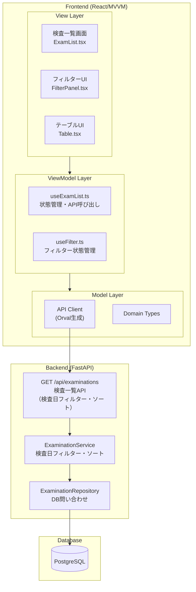

# 要件定義書: 検査一覧機能 (exam-list)

## はじめに

本ドキュメントは、ECG心不全リスク推論システムにおける検査一覧機能の要件を定義する。
本機能は、フロントエンドとバックエンドの組み合わせにより実現される機能であり、
システムユーザー（医療従事者）がDB登録済みの検査データを一覧表示し、患者情報でフィルタリングして検索できる。
フロントエンドは指定された検査のデータをバックエンドAPIから取得し、取得したデータに対して他のフィルター条件（患者ID、患者氏名）を適用してUIとして表示する。

**責務境界:**

- **exam-list（本機能）**:
  - **フロントエンド**: 検査データのUI表示、フィルタリング（患者ID/氏名：フロントエンド側で適用）、ソート、検査選択
  - **バックエンド**: 検査日フィルターに基づくDB問い合わせ、ソート処理、検査データの取得
- **file-importer**: 検査データのDB登録（本機能のデータソース）
- **ecg-mi-inference（別途定義）**: 検査選択後の心不全リスク推論実行

**関連ユースケース:**

- UC-3: システムユーザーはDB登録済みの検査データを一覧表示できる
- UC-3-extend: システムユーザーは患者情報で検査データにフィルター条件を指定して一覧する

**技術選定:** React（MVVMアーキテクチャ）、TanStack Query（サーバー状態管理）、Orval（API型定義）

## 要件一覧

### 要件1: 検査データの一覧表示

**目的:** 医療従事者として、登録済みの検査データを一覧で確認したい。
これにより、処理済みの検査を把握し、推論対象を選択できる。

#### 受け入れ基準

1. When ユーザーが検査一覧画面にアクセスする, 検査一覧機能 shall DBから検査データを取得しテーブル形式で表示する
2. 検査一覧機能 shall 以下のカラムを表示する：検査日時、患者ID、患者氏名、性別、年齢
3. 検査一覧機能 shall 検査データを検査日時（降順：新しい順）でソートして表示する
4. 検査一覧機能 shall 総件数は表示しない
5. When データ取得中, 検査一覧機能 shall ローディングインジケーターを表示する
6. When データ取得に失敗した場合, 検査一覧機能 shall エラーメッセージを表示する

### 要件2: フィルタリング

**目的:** 医療従事者として、特定の条件で検査データを絞り込みたい。
これにより、大量の検査データから目的の検査を効率的に検索できる。

#### 受け入れ基準

**バックエンドフィルター（検査日）:**

1. 検査一覧機能 shall 検査日のピンポイント指定（単一日付）フィルターを提供する
2. 検査一覧機能 shall 検査日フィルターの初期値を当日（現在の日付）とする
3. When 検査日が変更される, 検査一覧機能 shall バックエンドAPIに検査日パラメータを送信し、該当日付の検査データのみを取得する
4. バックエンドAPI shall 検査日パラメータで当日0時00分00秒から23時59分59秒までの検査データをフィルタリングする

**フロントエンドフィルター（患者ID、患者氏名）:**

1. 検査一覧機能 shall 患者IDによる検索フィールドを提供する（フロントエンドで実装）
2. 検査一覧機能 shall 患者氏名による部分一致検索フィールドを提供する（フロントエンドで実装）
3. 検査一覧機能 shall 患者ID・患者氏名フィルターをバックエンドから取得したデータに対してフロントエンド側で適用する
4. 検査一覧機能 shall フィルター条件をクリアするボタンを提供する（検査日は当日にリセット、患者ID・患者氏名は空欄にリセット）
5. When 患者ID・患者氏名フィルター条件が変更される, 検査一覧機能 shall フロントエンド側で即座にフィルタリングを実行する（デバウンス: 500ms）
6. When フィルター結果が0件の場合, 検査一覧機能 shall 「該当する検査データがありません」というメッセージを表示する

### 要件3: ソート機能

**目的:** 医療従事者として、検査データを任意のカラムでソートしたい。
これにより、検査データを様々な視点で整理して確認できる。

#### 受け入れ基準

1. 検査一覧機能 shall 検査日時カラムをクリックでソート可能とする（昇順/降順）
2. 検査一覧機能 shall 患者IDカラムをクリックでソート可能とする（昇順/降順）
3. 検査一覧機能 shall 患者氏名カラムをクリックでソート可能とする（昇順/降順）
4. 検査一覧機能 shall 年齢カラムをクリックでソート可能とする（昇順/降順）
5. 検査一覧機能 shall 現在のソートカラムと方向を視覚的に表示する（▲/▼アイコン）
6. 検査一覧機能 shall ソート条件をクエリパラメータで保持する（ページリロード時も維持）

### 要件4: 検査選択

**目的:** 医療従事者として、一覧から検査を選択して詳細表示や推論実行に進みたい。
これにより、選択した検査に対して後続の操作を実行できる。

#### 受け入れ基準

1. 検査一覧機能 shall 各行をクリックで検査を選択可能とする
2. 検査一覧機能 shall 選択された行を視覚的にハイライト表示する
3. 検査一覧機能 shall 検査選択時に詳細表示画面への遷移リンクを提供する
4. 検査一覧機能 shall 検査選択時に「推論実行」ボタンを表示する
5. When 「推論実行」ボタンがクリックされる, 検査一覧機能 shall ecg-mi-inferencerサービスを呼び出す（別途定義）

### 要件5: データリフレッシュ

**目的:** 医療従事者として、最新の検査データを常に確認したい。
これにより、バックグラウンドで追加された検査や推論ステータスの更新を反映できる。

#### 受け入れ基準

1. 検査一覧機能 shall 手動リフレッシュボタンを提供する
2. 検査一覧機能 shall 手動リフレッシュ時にローディングインジケーターを表示する
3. When 画面がフォーカス状態に戻る（タブ切り替え後等）, 検査一覧機能 shall 自動リフレッシュを実行する
4. 検査一覧機能 shall 最後の更新日時を表示する（例: 「最終更新: 2025-12-07 14:30」）

---

## 非機能要件

### パフォーマンス

- 検査一覧機能 shall データ取得から表示までを2秒以内に完了する
- 検査一覧機能 shall 検査日フィルターをサーバーサイドで実行する（当日分の検査データのみ取得）
- 検査一覧機能 shall 患者ID・患者氏名フィルターをクライアントサイドで実行する（当日分のデータを取得後、フロントエンドでフィルタリング）

### ユーザビリティ

- 検査一覧機能 shall テーブルの行をホバー時にハイライト表示する
- 検査一覧機能 shall キーボード操作（Tab、Enter、矢印キー）で操作可能とする
- 検査一覧機能 shall アクセシビリティ対応（ARIA属性、スクリーンリーダー対応）を行う

### セキュリティ

- 検査一覧機能 shall 認可トークン（JWT）をリクエストヘッダーに含めてAPIを呼び出す
- 検査一覧機能 shall 認可トークンが無効な場合、ログイン画面へリダイレクトする
- 検査一覧機能 shall 患者情報を含むログを出力しない

---

## データモデル概要

### 検査一覧APIレスポンス

| フィールド | 型 | 説明 |
|------------|------|------|
| `id` | UUID | 検査ID |
| `exam_date` | DateTime | 検査日時 |
| `patient` | Object | 患者情報 |
| `patient.id` | UUID | 患者ID |
| `patient.external_id` | String | 患者外部ID（MFER内のID） |
| `patient.name` | String | 患者氏名 |
| `patient.gender` | String | 性別（男性/女性） |
| `patient.age` | int | 年齢 |
| `created_at` | DateTime | 登録日時 |

### バックエンドAPIクエリパラメータ

| パラメータ | 型 | 必須 | 説明 |
|------------|------|------|------|
| `exam_date` | Date | ✓ | 検査日（YYYY-MM-DD形式、当日0時00分00秒から23時59分59秒までの検査データを取得） |
| `sort_by` | String | - | ソートカラム（exam_date/patient_id/patient_name/age、デフォルト: exam_date） |
| `sort_order` | String | - | ソート順（asc/desc、デフォルト: desc） |

**注意:** 患者ID・患者氏名によるフィルタリングはフロントエンドで実装し、バックエンドAPIには送信しない。

---

## アーキテクチャ境界図



---

## UIモック（主要画面構成）

```text
┌─────────────────────────────────────────────────────────┐
│  検査一覧                                                │
├─────────────────────────────────────────────────────────┤
│  [フィルター]                                            │
│  検査日: [2025年12月07日 ▼] 患者ID: [________]  氏名: [________] [クリア]  [🔄 更新] │
├─────────────────────────────────────────────────────────┤
│  検査日時    │患者ID│氏名    │性別│年齢│
├──────────────┼──────┼────────┼────┼────┼
│  2025-12-07  │P-001 │山田太郎│男性│75  │
│  14:30       │      │        │    │    │
├──────────────┼──────┼────────┼────┼────┼
│  2025-12-07  │P-002 │佐藤花子│女性│60  │
│  13:15       │      │        │    │    │
└─────────────────────────────────────────────────────────┘
│  最終更新: 2025-12-07 14:35                            │
└─────────────────────────────────────────────────────────┘
```

---

## 用語定義

| 用語 | 定義 |
|------|------|
| 検査データ | 1回の心電図検査に対応するレコード（file-importerで登録） |
| 患者ID | システム内部の患者UUID（検査データの外部キー） |
| 患者外部ID | MFERファイル内の患者識別子（検索用） |
| フィルタリング | 検査データを条件で絞り込む機能（検査日：バックエンド、患者ID/氏名：フロントエンド） |

---

**ステータス:** レビュー待ち
**作成日:** 2025-12-07
**最終更新:** 2025-12-07
