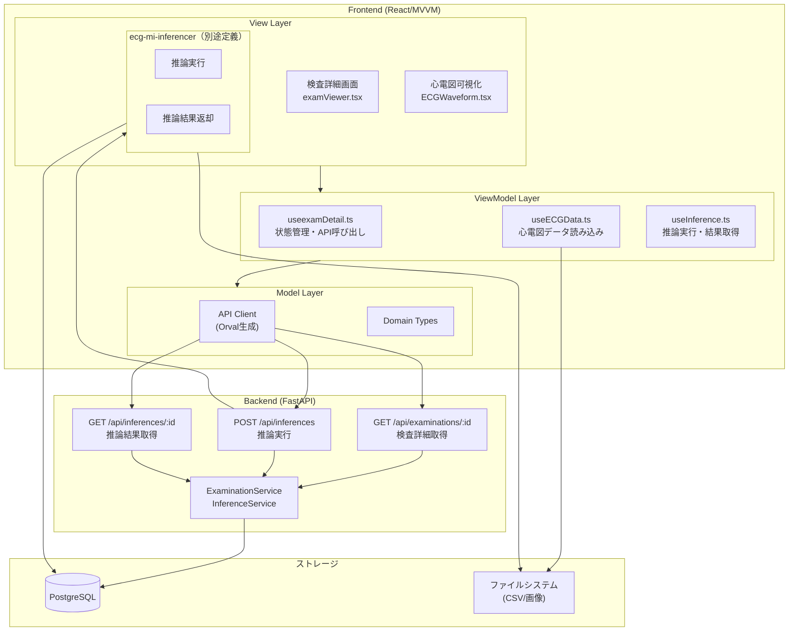

# 要件定義書: 検査詳細表示機能 (exam-viewer)

## はじめに

本ドキュメントは、ECG心不全リスク推論システムにおける検査詳細表示機能の要件を定義する。
本機能は、検査一覧から選択された検査データについて、患者情報・心電図・推論結果を一画面で統合表示する
フロントエンド機能である。

**責務境界:**
- **exam-viewer（本機能）**: 検査詳細の表示、患者情報表示、心電図可視化、推論結果表示、推論実行
- **exam-list**: 検査選択（本機能への遷移トリガー）
- **ecg-mi-inferencer（別途定義）**: 心電図波形解析、心不全リスク推論実行、推論結果の返却
- **file-importer**: 検査データ・患者データのDB登録（本機能のデータソース）

**関連ユースケース:**
- UC-4: システムユーザーは検査データを選択し、結果・患者データ・心電図を参照できる
- UC-4-extend: システムはシステムユーザーの検査データ選択時に、心不全推論を実行する
- Core Capability 5: 統合結果表示（患者情報・心電図・推論結果を一画面で確認）

**技術選定:** React（MVVMアーキテクチャ）、TanStack Query（サーバー状態管理）、Orval（API型定義）、Chart.js/Recharts（心電図可視化）

## 要件一覧

### 要件1: 検査詳細の取得と表示

**目的:** 医療従事者として、選択した検査の詳細情報を確認したい。
これにより、検査に紐づく全ての情報を一括して把握できる。

#### 受け入れ基準

1. When 検査一覧画面から検査が選択される, 検査詳細表示機能 shall 検査UUIDをパラメータとして受け取る
2. When 検査詳細画面にアクセスする, 検査詳細表示機能 shall バックエンドAPIから検査データを取得する
3. 検査詳細表示機能 shall 検査UUIDをクエリパラメータまたはルートパラメータとして受け取る
4. When データ取得中, 検査詳細表示機能 shall ローディングインジケーターを表示する
5. When データ取得に失敗した場合, 検査詳細表示機能 shall エラーメッセージを表示する
6. When 検査データが存在しない場合, 検査詳細表示機能 shall 「検査データが見つかりません」というメッセージを表示する

### 要件2: 患者情報の表示

**目的:** 医療従事者として、検査に紐づく患者情報を確認したい。
これにより、患者の基本情報を把握し、診断判断の参考とすることができる。

#### 受け入れ基準

1. 検査詳細表示機能 shall 以下の患者情報を表示する：患者ID（外部ID）、患者氏名、生年月日、年齢、性別
2. 検査詳細表示機能 shall 患者情報セクションを画面上部に表示する
3. 検査詳細表示機能 shall 患者情報をカード形式または表形式で視覚的に整理して表示する
4. 検査詳細表示機能 shall 年齢を生年月日から自動計算して表示する

### 要件3: 検査情報の表示

**目的:** 医療従事者として、検査の基本情報を確認したい。
これにより、検査日時や関連情報を把握できる。

#### 受け入れ基準

1. 検査詳細表示機能 shall 以下の検査情報を表示する：検査日時、検査UUID、登録日時
2. 検査詳細表示機能 shall 検査情報を患者情報セクションの下に表示する
3. 検査詳細表示機能 shall 検査日時を「YYYY-MM-DD HH:mm:ss」形式で表示する

### 要件4: 心電図波形の可視化表示

**目的:** 医療従事者として、心電図波形データを視覚的に確認したい。
これにより、心電図のパターンを直接確認し、推論結果と照合できる。

#### 受け入れ基準

1. 検査詳細表示機能 shall 心電図波形データをグラフ形式で表示する
2. 検査詳細表示機能 shall CSVファイルから心電図波形データを読み込んで表示する
3. 検査詳細表示機能 shall 12誘導心電図を全て表示する（I, II, III, aVR, aVL, aVF, V1-V6）
4. 検査詳細表示機能 shall 各誘導を縦方向に配置し、時系列データを横軸に表示する
5. 検査詳細表示機能 shall サンプリングレート情報を表示する
6. 検査詳細表示機能 shall 心電図データの読み込み中にローディングインジケーターを表示する
7. When 心電図データが存在しない場合, 検査詳細表示機能 shall 「心電図データがありません」というメッセージを表示する
8. 検査詳細表示機能 shall 心電図波形のズーム・パン操作を提供する
9. 検査詳細表示機能 shall 表示範囲のリセットボタンを提供する

### 要件5: 推論結果の表示

**目的:** 医療従事者として、AIによる心不全リスク推論結果を確認したい。
これにより、客観的なリスク評価を参考に診断判断を支援できる。

#### 受け入れ基準

1. 検査詳細表示機能 shall 推論ステータス（未実行/実行中/完了/エラー）を表示する
2. 検査詳細表示機能 shall 推論ステータスが「完了」の場合、推論結果を表示する
3. 検査詳細表示機能 shall 推論結果に以下の情報を含める：リスクスコア（0-100%）、リスクレベル（低/中/高）、推論実行日時
4. 検査詳細表示機能 shall リスクレベルを視覚的なバッジ（低：グリーン、中：イエロー、高：レッド）で表示する
5. 検査詳細表示機能 shall リスクスコアをプログレスバーまたはゲージチャートで表示する
6. When 推論ステータスが「未実行」または「エラー」の場合, 検査詳細表示機能 shall 「推論実行」ボタンを表示する
7. When 推論ステータスが「実行中」の場合, 検査詳細表示機能 shall 進行状況インジケーターを表示する
8. When 推論結果が存在する場合, 検査詳細表示機能 shall 推論結果セクションを検査情報の下に表示する

### 要件6: 推論実行機能

**目的:** 医療従事者として、未実行の検査に対して心不全リスク推論を実行したい。
これにより、AIによるリスク評価を得て診断判断の参考とすることができる。

#### 受け入れ基準

1. 検査詳細表示機能 shall 「推論実行」ボタンを検査詳細画面に表示する（推論ステータスが「未実行」または「エラー」の場合）
2. When 「推論実行」ボタンがクリックされる, 検査詳細表示機能 shall 確認ダイアログを表示する
3. When 確認ダイアログで「実行」が選択される, 検査詳細表示機能 shall ecg-mi-inferencerサービスを呼び出す
4. 検査詳細表示機能 shall 検査UUIDをecg-mi-inferencerに渡す
5. When 推論実行が開始される, 検査詳細表示機能 shall 推論ステータスを「実行中」に更新する
6. 検査詳細表示機能 shall 推論実行中は「推論実行」ボタンを無効化する
7. When 推論が完了する, 検査詳細表示機能 shall 推論結果を取得し表示を更新する
8. When 推論がエラー終了する, 検査詳細表示機能 shall エラーメッセージを表示する
9. 検査詳細表示機能 shall 推論実行中に定期的（5秒間隔）にステータスをポーリングして更新する

### 要件7: データ自動更新

**目的:** 医療従事者として、推論実行中に最新のステータスを自動的に確認したい。
これにより、推論完了を待たずに最新情報を把握できる。

#### 受け入れ基準

1. When 推論ステータスが「実行中」の場合, 検査詳細表示機能 shall 自動的にステータスをポーリングする（5秒間隔）
2. When 推論ステータスが「完了」または「エラー」に変化した場合, 検査詳細表示機能 shall ポーリングを停止する
3. When 画面がフォーカス状態に戻る（タブ切り替え後等）, 検査詳細表示機能 shall 検査データを再取得する

### 要件8: ナビゲーション機能

**目的:** 医療従事者として、検査詳細画面から他の画面へ遷移したい。
これにより、検査一覧に戻るなどの操作ができる。

#### 受け入れ基準

1. 検査詳細表示機能 shall 「検査一覧に戻る」ボタンを提供する
2. When 「検査一覧に戻る」ボタンがクリックされる, 検査詳細表示機能 shall 検査一覧画面へ遷移する
3. 検査詳細表示機能 shall ブラウザの戻るボタンでも検査一覧画面に戻れるようにする

---

## 非機能要件

### パフォーマンス

- 検査詳細表示機能 shall 検査データ取得から表示までを2秒以内に完了する
- 検査詳細表示機能 shall 心電図データの読み込みから表示までを3秒以内に完了する
- 検査詳細表示機能 shall 推論結果の表示を1秒以内に完了する

### ユーザビリティ

- 検査詳細表示機能 shall 心電図波形が読みやすいように適切な色と線の太さを使用する
- 検査詳細表示機能 shall 各セクション（患者情報、検査情報、心電図、推論結果）を明確に区別して表示する
- 検査詳細表示機能 shall 重要な情報（リスクレベル、リスクスコア）を目立つように表示する

### セキュリティ

- 検査詳細表示機能 shall 認可トークン（JWT）をリクエストヘッダーに含めてAPIを呼び出す
- 検査詳細表示機能 shall 認可トークンが無効な場合、ログイン画面へリダイレクトする
- 検査詳細表示機能 shall 患者情報を含むログを出力しない

---

## データモデル概要

### 検査詳細APIレスポンス

| フィールド | 型 | 説明 |
|------------|------|------|
| `id` | UUID | 検査ID |
| `exam_date` | DateTime | 検査日時 |
| `mfer_file_path` | String | MFERファイルのパス |
| `created_at` | DateTime | 登録日時 |
| `patient` | Object | 患者情報 |
| `patient.id` | UUID | 患者ID |
| `patient.external_id` | String | 患者外部ID（MFER内のID） |
| `patient.name` | String | 患者氏名 |
| `patient.gender` | String | 性別（男性/女性） |
| `patient.birth_date` | Date | 生年月日 |
| `inference` | Object | 推論結果（null許容） |
| `inference.status` | String | 推論ステータス（未実行/実行中/完了/エラー） |
| `inference.risk_score` | Float | リスクスコア（0.0-100.0） |
| `inference.risk_level` | String | リスクレベル（低/中/高） |
| `inference.executed_at` | DateTime | 推論実行日時 |
| `csv_file_path` | String | CSVファイルのパス（心電図波形データ） |

### 推論実行APIリクエスト

| パラメータ | 型 | 必須 | 説明 |
|------------|------|------|------|
| `examination_id` | UUID | ✓ | 検査ID |

### 推論実行APIレスポンス

| フィールド | 型 | 説明 |
|------------|------|------|
| `status` | String | 推論ステータス（実行中/完了/エラー） |
| `examination_id` | UUID | 検査ID |

---

## アーキテクチャ境界図



---

## UIモック（主要画面構成）

```text
┌─────────────────────────────────────────────────────────┐
│  [← 検査一覧に戻る]                     検査詳細        │
├─────────────────────────────────────────────────────────┤
│  [患者情報]                                             │
│  患者ID: P-001    氏名: 山田太郎    性別: 男性          │
│  生年月日: 1950-01-15    年齢: 75歳                    │
├─────────────────────────────────────────────────────────┤
│  [検査情報]                                             │
│  検査日時: 2025-12-07 14:30:00                         │
│  検査ID: 123e4567-e89b-12d3-a456-426614174000          │
├─────────────────────────────────────────────────────────┤
│  [推論結果]                      [推論実行]             │
│  ステータス: ● 完了                                     │
│  リスクスコア: ████████░░ 78%                          │
│  リスクレベル: [高] レッドバッジ                       │
│  推論実行日時: 2025-12-07 14:35:00                     │
├─────────────────────────────────────────────────────────┤
│  [心電図波形]                                           │
│  ┌─────────────────────────────────────────────┐       │
│  │ I:    ────╱╲────                            │       │
│  │ II:   ───╱╲───                              │       │
│  │ III:  ──╱╲──                                │       │
│  │ aVR:  ─╱╲─                                  │       │
│  │ ...   (12誘導全て表示)                      │       │
│  │ [ズーム] [パン] [リセット]                  │       │
│  └─────────────────────────────────────────────┘       │
└─────────────────────────────────────────────────────────┘
```

---

## 用語定義

| 用語 | 定義 |
|------|------|
| 検査詳細 | 1回の心電図検査に対応する全ての情報（患者情報、検査情報、心電図、推論結果） |
| 心電図波形 | CSVファイルに保存された時系列の心電図データ |
| 12誘導 | 心電図の標準的な12個の測定位置（I, II, III, aVR, aVL, aVF, V1-V6） |
| 推論結果 | AIによる心不全リスク推論の出力（リスクスコア、リスクレベル） |
| リスクスコア | 0-100%の数値で表される心不全リスクの程度 |
| リスクレベル | リスクスコアに基づく分類（低/中/高） |
| ecg-mi-inferencer | 心電図波形を解析し心不全リスクを推論するサービス |

---

**ステータス:** レビュー待ち
**作成日:** 2025-12-07
**最終更新:** 2025-12-07

