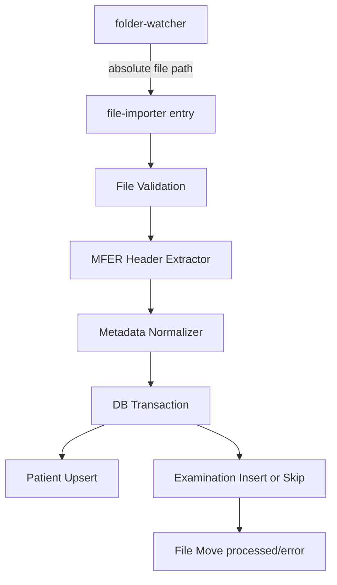

# 設計ドキュメント: ファイルインポート機能 (file-importer)

## 概要

`file-importer` は `folder-watcher` から受け取った MFER ファイルパスを入力として、
患者属性と診察メタデータを抽出し、`patients` / `examinations` テーブルへ登録する。

本機能は **波形データを扱わない**。波形読み込みや推論は `ecg-mi-inferencer` が担当する。

## 意思決定

- 入力ファイル判定は拡張子の **大文字小文字を無視**し、`.mwf` 系を対象にする
  - 例: `.mwf`, `.MWF`, `.MwF`
- MFER ヘッダー抽出は `mfer_tools.extract_mfer_header()` を利用する
- 解析で取得できない項目は `sample_data/*.XML` 互換の補助パーサで補完する
- 患者登録は `external_id`（MFER内患者ID）を自然キーとして upsert 相当で扱う
- 診察重複判定は `(patient_external_id, exam_datetime)` で行う

## アーキテクチャ



## コンポーネント設計

### 1. Entry Point

- パス: `backend/app/file_importer.py`
- インターフェース:
  - `import_mfer_file(file_path: str) -> None`
  - 将来 CLI: `python -m app.file_importer <path>`

### 2. MFER Header Extractor

- 利用ライブラリ: `mfer_tools`
- 呼び出し例:

```python
from mfer_tools import extract_mfer_header

header = extract_mfer_header("data/sample.MWF")
exam_time = header.get("MWF_TIM")
```

- 期待マッピング（初版）:
  - `MWF_TIM` -> 検査日時
  - `MWF_PID`（存在する場合） -> 患者ID
  - `MWF_PNM`（存在する場合） -> 患者名
  - 未取得時は XML 補完へフォールバック

### 3. XML Fallback Parser

- 対象: MWF と同名の `.xml/.XML`
- 例（sample_data で確認済み）:
  - 患者ID: `recordTarget/patientRole/patientPatient/id@extension`
  - 患者氏名: `.../name[@use='IDE']/family`
  - 性別: `administrativeGenderCode@code` (`M/F`)
  - 生年月日: `birthTime@value`
  - 検査日時: `effectiveTime/low@value`
  - 検査種別: `code@displayName` または `text`

### 4. DB Registration

- 患者:
  - `external_id` で既存検索
  - なければ作成、あれば再利用（更新しない）
- 診察:
  - `(patient_id, exam_date)` で重複判定
  - 重複時はスキップ + WARNING ログ
  - 非重複時は作成（`mfer_file_path` と `csv_file_path` に取り込み元の `.mwf` 絶対パス、`inference_status='未実行'`）
  - processed/error へファイル移動後は `mfer_file_path` / `csv_file_path` を移動先パスに更新（波形 CSV はインポート時には生成しない）

### 5. Transaction / Error

- 患者・診察登録は単一トランザクション
- DB失敗時は rollback
- ファイル移動失敗は WARNING（DB結果は維持）
- エラー分類:
  - FileError / ParseError / ValidationError / DBError / IOError

## ログ方針

- INFO: 処理開始、患者作成/再利用、診察作成/重複スキップ、処理成功
- WARNING: 重複、ファイル移動失敗
- ERROR: 解析失敗、バリデーション失敗、DB失敗
- 制約: 患者氏名などの機微情報はログ出力しない

## テスト設計

- 単体:
  - 拡張子判定（`.mwf/.MWF`）
  - ヘッダ抽出マッピング
  - XMLフォールバック抽出
  - 重複判定
- 統合:
  - sample_data の AKASHI MWF/XML で患者・診察登録
  - 同一ファイル再投入で重複スキップ
  - 不正ファイルで error への振り分け
