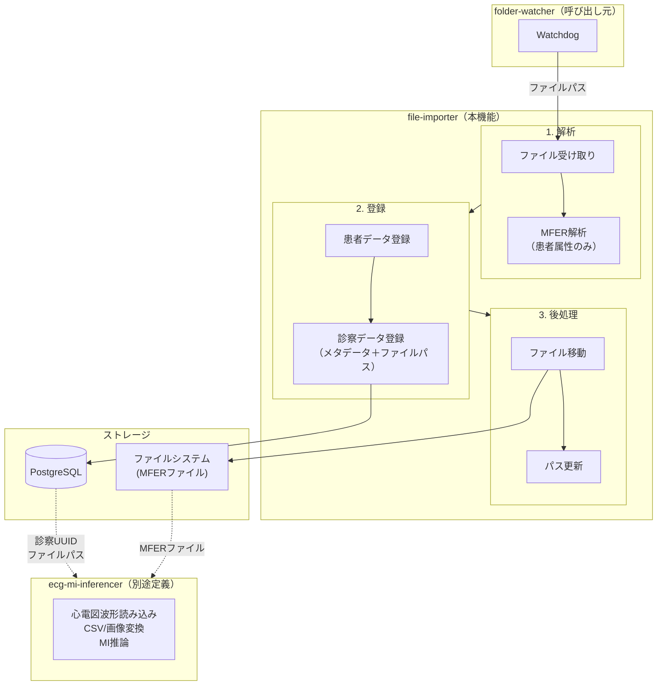
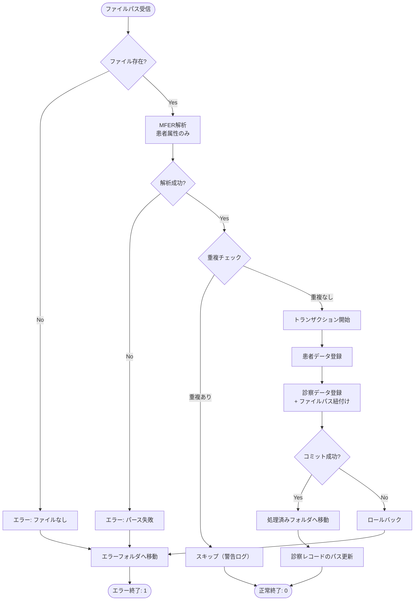

# 要件定義書: ファイルインポート機能 (file-importer)

## はじめに

本ドキュメントは、ECG心筋梗塞リスク推論システムにおけるファイルインポート機能の要件を定義する。
本機能は、`folder-watcher` から呼び出され、MFERファイルから患者属性を抽出し、
患者データおよび診察データ（検索用メタデータ）をデータベースに登録する。

**注意:** 心電図波形データの読み込み・変換・推論は本機能のスコープ外であり、
`ecg-mi-inferencer` サービスで別途実装する。

**責務境界:**
- **folder-watcher（呼び出し元）**: フォルダ監視、ファイル検出、拡張子判定、file-importer呼び出し
- **file-importer（本機能）**: MFERから患者属性抽出、患者・診察データのDB登録、MFERファイルパス紐付け
- **ecg-mi-inferencer（別途定義）**: 心電図波形読み込み、CSV変換、画像変換、心筋梗塞リスク推論

**関連ユースケース:**
- UC-1（システムは指定フォルダを監視し、新規MFERデータ追加時に診察データ・患者データをDBへ自動登録する）の「解析・登録」部分
- UC-3（システムユーザーはDB登録済みの診察データを一覧表示できる）の検索用データ登録

## 要件一覧

### 要件1: MFERファイルの受け取り

**目的:** システムとして、folder-watcherから渡されたMFERファイルを処理したい。
これにより、検出されたファイルを解析・登録処理の対象とすることができる。

#### 受け入れ基準

1. When folder-watcherからファイルパスを受け取る, file-importer shall ファイルの存在を確認する
2. If ファイルが存在しない場合, then file-importer shall エラーを返しログを出力する
3. If ファイルが読み取り可能でない場合, then file-importer shall エラーを返しログを出力する
4. file-importer shall 処理開始時にINFOレベルのログを出力する（ファイル名のみ）
5. file-importer shall CLIコマンドまたはPython関数として呼び出し可能とする

### 要件2: MFERファイルの解析（患者属性のみ）

**目的:** システムとして、MFERファイルから患者情報と診察メタデータを抽出したい。
これにより、診察一覧の検索用データをシステムに取り込むことができる。

#### 受け入れ基準

1. When MFERファイルを解析する, file-importer shall MFER形式のバイナリデータから患者属性をパースする
2. file-importer shall 以下の患者情報を抽出する：患者ID、氏名、生年月日、性別
3. file-importer shall 以下の診察メタデータを抽出する：検査日時、検査種別
4. file-importer shall 心電図波形データは読み込まない（スキップする）
5. If MFERファイルの形式が不正な場合, then file-importer shall パースエラーを返す
6. If 必須項目（患者ID、検査日時）が欠落している場合, then file-importer shall バリデーションエラーを返す

### 要件3: 患者データの登録

**目的:** システムとして、抽出された患者情報をデータベースに登録したい。
これにより、患者マスタを構築し、診察データとの紐付けを可能にする。

#### 受け入れ基準

1. When 患者情報が抽出される, file-importer shall 患者ID（MFER内のID）でデータベースを検索する
2. If 患者IDが存在しない場合, then file-importer shall 新規患者レコードを作成する
3. If 患者IDが既に存在する場合, then file-importer shall 既存の患者レコードを使用する（更新しない）
4. file-importer shall 患者レコードにUUID（システム内部ID）を付与する
5. file-importer shall 患者情報の登録日時を記録する
6. file-importer shall 患者レコードの作成/既存使用をログに出力する

### 要件4: 診察データの登録

**目的:** システムとして、診察メタデータをデータベースに登録したい。
これにより、診察一覧の検索・表示対象となるレコードを作成する。

#### 受け入れ基準

1. When 診察メタデータが抽出される, file-importer shall 患者IDと検査日時の組み合わせで重複チェックを行う
2. If 同一の患者ID・検査日時の診察データが存在する場合, then file-importer shall 警告ログを出力し処理をスキップする
3. If 重複がない場合, then file-importer shall 新規診察レコードを作成する
4. file-importer shall 診察レコードに患者レコードへの参照（UUID）を設定する
5. file-importer shall 診察レコードにUUIDを付与する
6. file-importer shall 診察データの登録日時を記録する
7. file-importer shall 元のMFERファイルの絶対パスを診察レコードに記録する
8. file-importer shall 推論ステータスを「未実行」として初期化する

### 要件5: MFERファイルパスの紐付け

**目的:** システムとして、診察データと元のMFERファイルを紐付けたい。
これにより、後続の `ecg-mi-inferencer` が診察UUIDからMFERファイルを参照できる。

#### 受け入れ基準

1. file-importer shall 診察レコードにMFERファイルの絶対パスを記録する
2. file-importer shall ファイルパスが有効であることを登録前に確認する
3. file-importer shall 処理済みフォルダへの移動後も参照可能なパスを記録する
4. If 処理済みフォルダが設定されている場合, then file-importer shall 移動後のパスを記録する

### 要件6: 処理済みファイルの移動

**目的:** システム管理者として、処理済みのMFERファイルを管理したい。
これにより、ファイルの再処理を防止し、障害時のトラブルシューティングを容易にする。

#### 受け入れ基準

1. When すべての処理が正常に完了する, file-importer shall ファイルを処理済みフォルダへ移動する
2. When いずれかの処理が失敗する, file-importer shall ファイルをエラーフォルダへ移動する
3. file-importer shall 処理済みフォルダを環境変数 `MFER_PROCESSED_FOLDER` で設定可能とする
4. file-importer shall エラーフォルダを環境変数 `MFER_ERROR_FOLDER` で設定可能とする
5. If 移動先フォルダが存在しない場合, then file-importer shall フォルダを自動的に作成する
6. file-importer shall ファイル移動をログに出力する
7. file-importer shall 移動後のパスで診察レコードのファイルパスを更新する

### 要件7: トランザクション管理

**目的:** システムとして、データの整合性を維持したい。
これにより、部分的なデータ登録による不整合を防止する。

#### 受け入れ基準

1. file-importer shall 患者登録・診察登録を単一トランザクション内で実行する
2. If いずれかのDB操作が失敗した場合, then file-importer shall トランザクションをロールバックする
3. file-importer shall DB登録成功後にファイル移動を実行する
4. If ファイル移動が失敗した場合, then file-importer shall 警告ログを出力するがDB登録は維持する

### 要件8: エラーハンドリング

**目的:** システムとして、処理中のエラーを適切に処理したい。
これにより、エラー原因の特定と復旧を容易にする。

#### 受け入れ基準

1. file-importer shall エラー種別を以下に分類する：ファイルエラー、パースエラー、バリデーションエラー、DBエラー、IOエラー
2. When エラーが発生する, file-importer shall エラー種別とメッセージをログに出力する
3. file-importer shall エラー時に終了コード1を返す
4. file-importer shall 正常終了時に終了コード0を返す
5. file-importer shall エラー詳細（スタックトレース）をDEBUGレベルでログ出力する

---

## 非機能要件

### パフォーマンス

- file-importer shall 1ファイルの処理を10秒以内に完了する（波形データを読み込まないため高速）
- file-importer shall メモリ使用量を100MB以下に抑える

### 信頼性

- file-importer shall 処理の冪等性を保証する（同一ファイルを複数回処理しても結果が同じ）
- file-importer shall 部分的なデータが残らないようトランザクション管理を行う

### セキュリティ

- file-importer shall 患者情報を含むログは出力しない（患者IDのみ可）
- file-importer shall 生成ファイルのアクセス権限を適切に設定する

---

## スコープ外（ecg-mi-inferencerの責務）

以下の機能は本機能のスコープ外であり、`ecg-mi-inferencer` サービスで実装する：

- MFERファイルから心電図波形データの読み込み
- 心電図波形データのCSV変換
- Vision Transformer用画像変換
- 心筋梗塞リスク推論
- 推論結果のDB登録

---

## 用語定義

| 用語 | 定義 |
|------|------|
| MFER | Medical waveform Format Encoding Rules、医療波形データの標準フォーマット |
| MWF | MFER形式ファイルの拡張子（.mwf） |
| 患者ID | MFERファイル内に記録された患者識別子（外部ID） |
| UUID | システム内部で付与する一意識別子 |
| 診察データ | 1回の心電図検査に対応するレコード（検索用メタデータ） |
| 推論ステータス | 心筋梗塞リスク推論の実行状態（未実行/実行中/完了/エラー） |
| ecg-mi-inferencer | 心電図波形を解析し心筋梗塞リスクを推論するサービス |

---

## 環境変数一覧

| 変数名 | 必須 | デフォルト | 説明 |
|--------|------|-----------|------|
| `MFER_PROCESSED_FOLDER` | - | `./processed` | 処理済みファイルの移動先 |
| `MFER_ERROR_FOLDER` | - | `./error` | エラーファイルの移動先 |
| `DATABASE_URL` | ✓ | - | データベース接続文字列 |

---

## データモデル概要

### 患者テーブル (patients)

| カラム | 型 | 説明 |
|--------|------|------|
| id | UUID | システム内部ID（PK） |
| external_id | VARCHAR | MFERファイル内の患者ID |
| name | VARCHAR | 患者氏名 |
| birth_date | DATE | 生年月日 |
| gender | VARCHAR | 性別 |
| created_at | TIMESTAMP | 登録日時 |

### 診察テーブル (examinations)

| カラム | 型 | 説明 |
|--------|------|------|
| id | UUID | システム内部ID（PK） |
| patient_id | UUID | 患者への参照（FK） |
| exam_date | TIMESTAMP | 検査日時 |
| exam_type | VARCHAR | 検査種別 |
| mfer_file_path | VARCHAR | MFERファイルのパス |
| inference_status | VARCHAR | 推論ステータス（未実行/実行中/完了/エラー） |
| created_at | TIMESTAMP | 登録日時 |

---

## アーキテクチャ境界図

---

## 処理フロー

---

**ステータス:** レビュー待ち
**作成日:** 2025-12-07
**最終更新:** 2025-12-07
