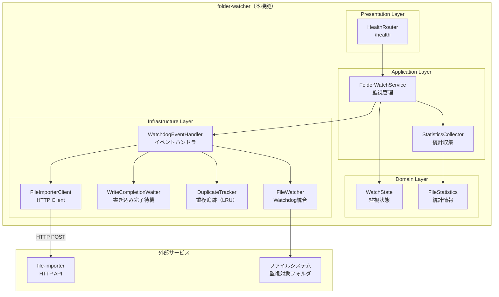
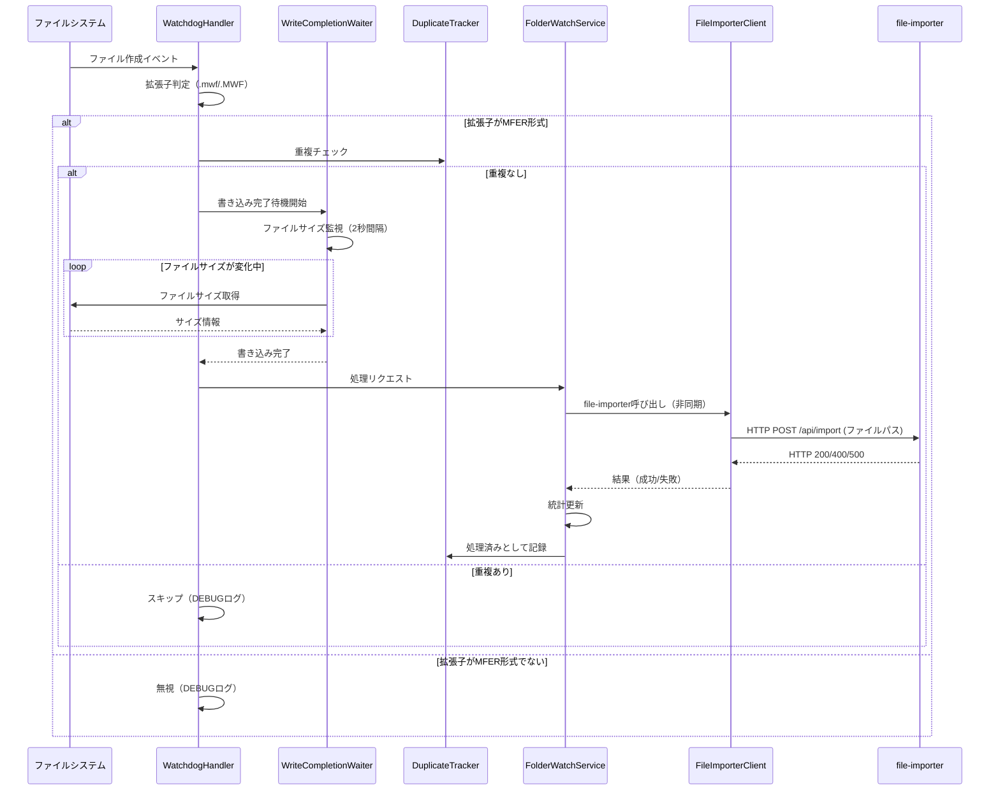
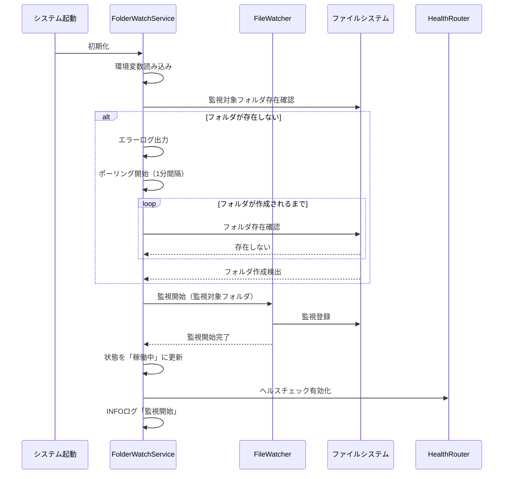
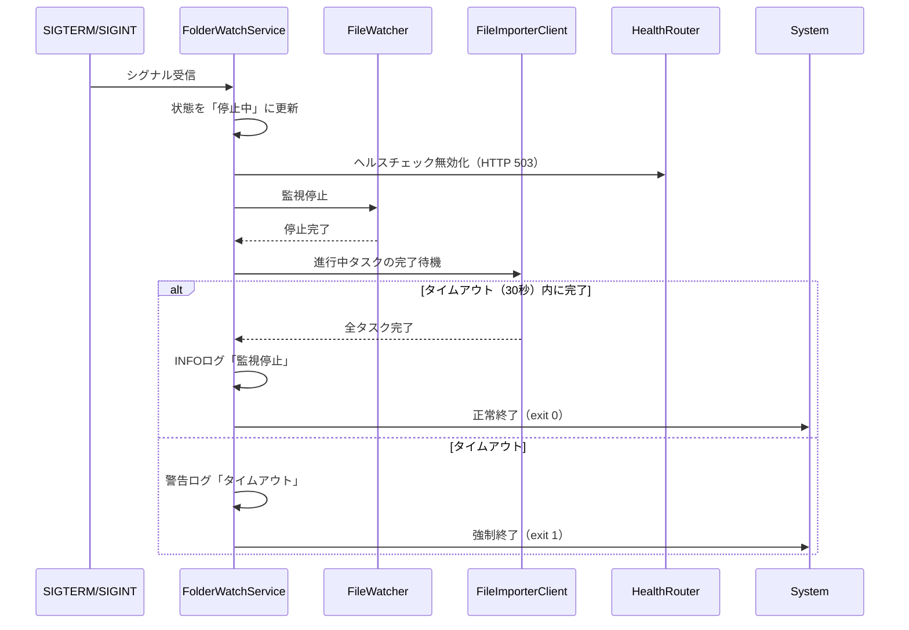
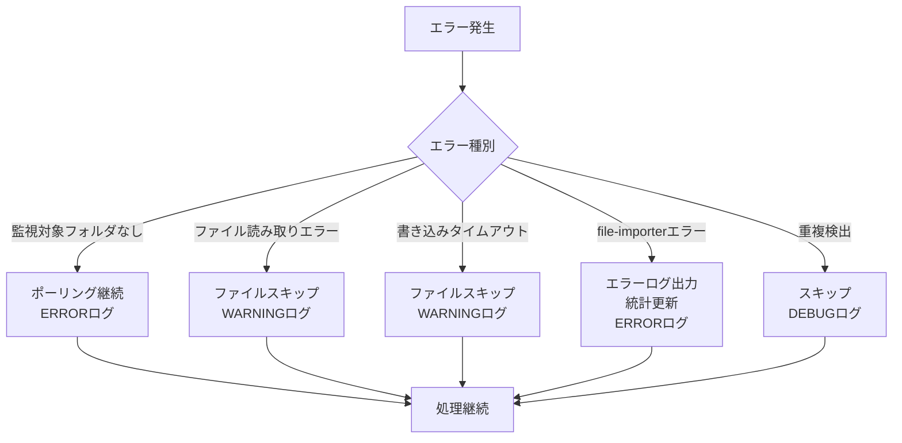

# 設計ドキュメント: フォルダ監視機能 (folder-watcher)

## 概要

**目的**: 本機能は、指定フォルダを監視し、新規MFERファイル（.mwf/.MWF）の追加を検出し、
`file-importer` サービスを呼び出すバックグラウンドサービスである。

**ユーザー**: システム管理者が監視対象フォルダを設定し、サービスを起動・停止する。

**特徴**: Watchdogライブラリによるファイルシステムイベント監視、書き込み完了待機、
重複検出防止、非同期処理によるfile-importer呼び出しを実現する。

### ゴール

- Watchdogによるファイルシステムイベント監視の実装
- MFERファイル検出と拡張子判定
- ファイル書き込み完了の待機（サイズ監視）
- file-importerへの非同期呼び出し（同時実行数制限）
- 重複処理の防止（LRU方式）
- ヘルスチェックエンドポイントによる監視状態の確認

### 非ゴール

- MFERファイルの解析・DB登録（file-importerの責務）
- 心電図波形データの処理（ecg-mi-inferencerの責務）
- ファイルの移動・削除（file-importerの責務）
- ユーザーインターフェース（バックグラウンドサービス）

## アーキテクチャ

### アーキテクチャパターン

**選択パターン**: Layered Architecture（Backend）

**ドメイン境界**:
- `app/api/` にヘルスチェックエンドポイント（Presentation層）
- `app/services/` にフォルダ監視サービス（Application層）
- `app/domain/` に監視状態・統計のドメインモデル（Domain層）
- `app/infrastructure/` にWatchdog統合、file-importer呼び出し（Infrastructure層）

**ステアリング準拠**:
- DDD原則に従い、ドメイン層は外部依存なし
- Layered Architectureで責務分離

### システム境界図



### 技術スタック

| Layer | 選択技術 | 役割 | 備考 |
|-------|----------|------|------|
| Backend | FastAPI + Python 3.14+ | ヘルスチェックAPI、サービス管理 | |
| ファイル監視 | Watchdog | ファイルシステムイベント監視 | |
| 非同期処理 | asyncio + aiohttp | file-importer呼び出し | |
| ログ | Python logging | ログ出力 | |
| シグナル処理 | signal | SIGTERM/SIGINTハンドリング | |

## システムフロー

### ファイル検出・処理フロー



### サービス起動フロー



### サービス停止フロー



## コンポーネント設計

### 1. FolderWatchService（Application層）

**責務**: フォルダ監視サービスのライフサイクル管理、状態管理、統計収集

**主要メソッド**:

```python
class FolderWatchService:
    async def start(self) -> None:
        """監視を開始する"""

    async def stop(self, timeout: int = 30) -> None:
        """監視を停止する（タイムアウト付き）"""

    def get_state(self) -> WatchState:
        """現在の監視状態を取得する"""

    def get_statistics(self) -> FileStatistics:
        """統計情報を取得する"""
```

**依存関係**:
- `WatchdogEventHandler`（Infrastructure層）
- `StatisticsCollector`（Application層）
- `WatchState`（Domain層）

### 2. WatchdogEventHandler（Infrastructure層）

**責務**: Watchdogイベントの処理、拡張子判定、書き込み完了待機のトリガー

**主要メソッド**:

```python
class WatchdogEventHandler(FileSystemEventHandler):
    def on_created(self, event: FileSystemEvent) -> None:
        """ファイル作成イベントを処理する"""

    def _is_mfer_file(self, file_path: str) -> bool:
        """拡張子がMFER形式（.mwf/.MWF）か判定する"""

    async def _wait_for_write_completion(
        self, file_path: str
    ) -> bool:
        """ファイル書き込み完了を待機する"""
```

**依存関係**:
- `WriteCompletionWaiter`（Infrastructure層）
- `DuplicateTracker`（Infrastructure層）
- `FileImporterClient`（Infrastructure層）

### 3. WriteCompletionWaiter（Infrastructure層）

**責務**: ファイルサイズの変化を監視し、書き込み完了を判定する

**主要メソッド**:

```python
class WriteCompletionWaiter:
    async def wait_for_completion(
        self, file_path: str, wait_interval: int = 2, timeout: int = 60
    ) -> bool:
        """ファイル書き込み完了を待機する

        Returns:
            True: 書き込み完了、False: タイムアウト
        """
```

### 4. DuplicateTracker（Infrastructure層）

**責務**: 処理中・処理済みファイルの追跡、LRU方式でのメモリ管理

**主要メソッド**:

```python
class DuplicateTracker:
    def is_duplicate(self, file_path: str) -> bool:
        """重複チェック"""

    def mark_processing(self, file_path: str) -> None:
        """処理中として記録"""

    def mark_completed(self, file_path: str) -> None:
        """処理完了として記録"""

    def _evict_oldest(self) -> None:
        """最も古いエントリを削除（LRU）"""
```

**実装**: `collections.OrderedDict`を使用し、LRU方式を実現

### 5. FileImporterClient（Infrastructure層）

**責務**: file-importer HTTP APIへの非同期呼び出し、同時実行数制限

**主要メソッド**:

```python
class FileImporterClient:
    async def import_file(self, file_path: str) -> ImportResult:
        """file-importerを呼び出す

        Returns:
            ImportResult(success: bool, message: str)
        """

    async def _call_importer_api(self, file_path: str) -> Response:
        """HTTP API呼び出し（POST /api/import）"""
```

**実装**: `aiohttp.ClientSession` + `asyncio.Semaphore`で同時実行数制限

### 6. StatisticsCollector（Application層）

**責務**: 統計情報の収集・集計

**主要メソッド**:

```python
class StatisticsCollector:
    def record_file_detected(self) -> None:
        """ファイル検出を記録"""

    def record_import_success(self) -> None:
        """インポート成功を記録"""

    def record_import_failure(self) -> None:
        """インポート失敗を記録"""

    def get_statistics(self) -> FileStatistics:
        """統計情報を取得"""
```

### 7. HealthRouter（Presentation層）

**責務**: ヘルスチェックエンドポイントの提供

**主要メソッド**:

```python
@router.get("/health")
async def health_check(
    service: FolderWatchService = Depends(get_watch_service)
) -> HealthResponse:
    """ヘルスチェックエンドポイント

    Returns:
        HTTP 200: 正常稼働中
        HTTP 503: 停止中または異常
    """
```

## データモデル

### WatchState（Domain層）

```python
@dataclass
class WatchState:
    """監視状態"""
    status: WatchStatus  # RUNNING, STOPPING, STOPPED
    watch_folder: str
    started_at: Optional[datetime]
    stopped_at: Optional[datetime]
    last_detected_at: Optional[datetime]
```

### FileStatistics（Domain層）

```python
@dataclass
class FileStatistics:
    """ファイル処理統計"""
    total_detected: int  # 検出ファイル数
    total_imported: int  # インポート成功数
    total_failed: int  # インポート失敗数
    current_processing: int  # 現在処理中数
    last_updated_at: datetime
```

### ImportResult（Infrastructure層）

```python
@dataclass
class ImportResult:
    """file-importer呼び出し結果"""
    success: bool
    message: str
    status_code: Optional[int] = None
```

## エラーハンドリング

### エラー種別

| エラー種別 | 処理 | ログレベル |
|-----------|------|----------|
| 監視対象フォルダが存在しない | ポーリング継続 | ERROR |
| ファイル読み取りエラー | ファイルをスキップ | WARNING |
| 書き込み完了待機タイムアウト | ファイルをスキップ | WARNING |
| file-importer呼び出しエラー | エラーログ出力、統計更新 | ERROR |
| 重複検出 | スキップ（ログなし） | DEBUG |

### エラーハンドリングフロー



## テスト戦略

### 単体テスト（Unit Tests）

**対象**: 各コンポーネントの個別テスト

| コンポーネント | テスト内容 |
|--------------|----------|
| `WatchdogEventHandler` | 拡張子判定、イベント処理 |
| `WriteCompletionWaiter` | 書き込み完了判定、タイムアウト |
| `DuplicateTracker` | 重複検出、LRU削除 |
| `FileImporterClient` | HTTP呼び出し、同時実行数制限 |
| `StatisticsCollector` | 統計収集・集計 |

**テストツール**: pytest, pytest-asyncio, pytest-mock

### 統合テスト（Integration Tests）

**対象**: コンポーネント間の連携テスト

- Watchdog → EventHandler → FileImporterClient の連携
- 実際のファイルシステムを使用したファイル検出テスト
- file-importerモックを使用した呼び出しテスト

**テストツール**: pytest, aioresponses（HTTPモック）

### E2Eテスト（End-to-End Tests）

**対象**: 実際の環境での動作確認

- 監視対象フォルダにMFERファイルを配置
- ファイル検出からfile-importer呼び出しまでの全フロー確認
- ヘルスチェックエンドポイントの動作確認

### カバレッジ目標

- **Backend**: 80% 以上

## デプロイメント/インストールノート

### 開発環境（Docker Compose）

```yaml
# docker-compose.yml
services:
  folder-watcher:
    build: ./backend
    environment:
      - MFER_WATCH_FOLDER=/data/mfer
      - MFER_WATCH_RECURSIVE=true
      - MFER_MAX_CONCURRENT=5
      - MFER_HEALTH_PORT=8081
      - FILE_IMPORTER_URL=http://file-importer:8000
    volumes:
      - ./data/mfer:/data/mfer:ro
    command: python -m app.services.folder_watcher
```

### 本番環境（ローカルインストール）

**依存パッケージ**:
```bash
pip install fastapi uvicorn watchdog aiohttp
```

**起動コマンド**:
```bash
export MFER_WATCH_FOLDER=/path/to/watch
export FILE_IMPORTER_URL=http://localhost:8000
python -m app.services.folder_watcher
```

**systemdサービス例**:
```ini
[Unit]
Description=Folder Watcher Service
After=network.target

[Service]
Type=simple
User=ecg-user
WorkingDirectory=/opt/ecg-mi-inference/backend
Environment="MFER_WATCH_FOLDER=/data/mfer"
Environment="FILE_IMPORTER_URL=http://localhost:8000"
ExecStart=/usr/bin/python3 -m app.services.folder_watcher
Restart=on-failure
RestartSec=10

[Install]
WantedBy=multi-user.target
```

### 設定要件

- 監視対象フォルダへの読み取り権限
- file-importerサービスへのネットワークアクセス
- ヘルスチェックポート（デフォルト: 8081）の開放

---

**ステータス:** レビュー待ち
**作成日:** 2025-12-07
**最終更新:** 2025-12-07


