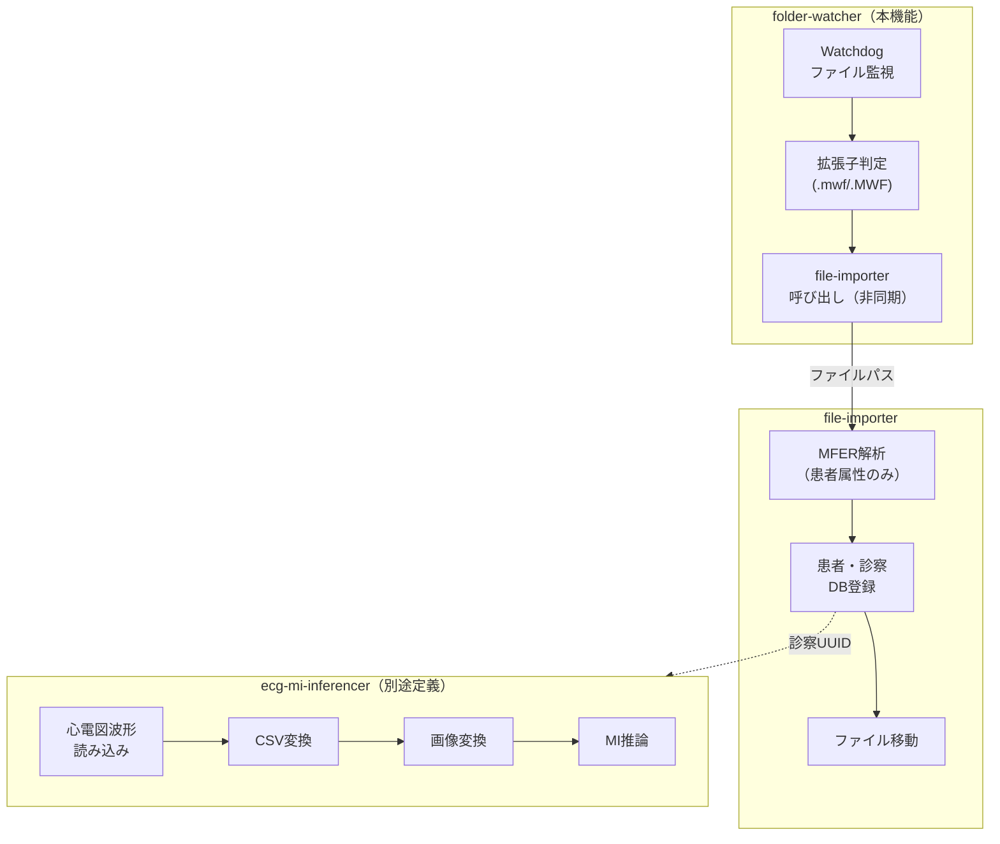

# 要件定義書: フォルダ監視機能 (folder-watcher)

## はじめに

本ドキュメントは、ECG心筋梗塞リスク推論システムにおけるフォルダ監視機能の要件を定義する。
本機能は、指定フォルダを監視し、新規MFERファイル（.mwf）の追加を検出した際に
`file-importer` サービスを呼び出すバックグラウンドサービスである。

**責務境界:**
- **folder-watcher（本機能）**: フォルダ監視、ファイル検出、拡張子判定、file-importer呼び出し
- **file-importer**: MFERファイルから患者属性を抽出、患者・診察データのDB登録（検索用）、MFERファイルパスとの紐付け
- **ecg-mi-inferencer（別途定義）**: 心電図波形の読み込み、CSV変換、画像変換、心筋梗塞リスク推論

**関連ユースケース:** UC-1（システムは指定フォルダを監視し、新規MFERデータ追加時に診察データ・患者データをDBへ自動登録する）の「監視・検出」部分

**技術選定:** Python Watchdog ライブラリを使用

## 要件一覧

### 要件1: フォルダ監視の開始

**目的:** システム管理者として、MFERファイルの監視対象フォルダを指定し、監視を開始したい。
これにより、心電計からの出力フォルダを監視し、新規ファイルを検出できる。

#### 受け入れ基準

1. When システムが起動する, フォルダ監視機能 shall 環境変数 `MFER_WATCH_FOLDER` で指定されたフォルダの監視を開始する
2. If 監視対象フォルダが存在しない場合, then フォルダ監視機能 shall エラーログを出力しフォルダが作成されるまでポーリングする
3. When 監視対象フォルダが作成される, フォルダ監視機能 shall 自動的に監視を開始する
4. フォルダ監視機能 shall 監視開始時にINFOレベルのログを出力する
5. フォルダ監視機能 shall Watchdogライブラリを使用してファイルシステムイベントを監視する

### 要件2: フォルダ監視の停止

**目的:** システムとして、シャットダウン時に監視を正常に終了したい。
これにより、リソースリークを防止し、処理中のファイルの整合性を確保する。

#### 受け入れ基準

1. When システムがSIGTERMシグナルを受信する, フォルダ監視機能 shall 監視を停止する
2. When 監視停止が要求される, フォルダ監視機能 shall 進行中のfile-importer呼び出しの完了を待機する
3. フォルダ監視機能 shall 待機タイムアウトを環境変数 `MFER_SHUTDOWN_TIMEOUT` で設定可能とする（デフォルト: 30秒）
4. When 監視が停止する, フォルダ監視機能 shall INFOレベルのログを出力する

### 要件3: MFERファイルの検出

**目的:** システムとして、監視対象フォルダに追加されたMFERファイルを検出したい。
これにより、処理対象ファイルを特定し、後続のfile-importerに引き渡すことができる。

#### 受け入れ基準

1. When 監視対象フォルダにファイルが作成される, フォルダ監視機能 shall ファイル作成イベントを受信する
2. When ファイル作成イベントを受信する, フォルダ監視機能 shall ファイルの拡張子を検証する
3. If ファイルの拡張子が `.mwf` または `.MWF` の場合, then フォルダ監視機能 shall ファイルを処理対象として認識する
4. If ファイルの拡張子がMFER形式でない場合, then フォルダ監視機能 shall ファイルを無視しDEBUGログを出力する
5. フォルダ監視機能 shall サブフォルダ内のファイルを再帰的に監視するかを環境変数 `MFER_WATCH_RECURSIVE` で設定可能とする

### 要件4: ファイル書き込み完了の待機

**目的:** システムとして、ファイルの書き込みが完了してからfile-importerを呼び出したい。
これにより、不完全なファイルの処理を防止する。

#### 受け入れ基準

1. When MFERファイルが検出される, フォルダ監視機能 shall ファイルサイズの変化を監視する
2. While ファイルサイズが変化している, フォルダ監視機能 shall file-importer呼び出しを待機する
3. When ファイルサイズが一定時間（デフォルト: 2秒）変化しない, フォルダ監視機能 shall 書き込み完了と判断する
4. フォルダ監視機能 shall 書き込み完了待機の間隔を環境変数 `MFER_WRITE_WAIT_INTERVAL` で設定可能とする
5. If 書き込み完了待機がタイムアウト（デフォルト: 60秒）した場合, then フォルダ監視機能 shall 警告ログを出力しファイルをスキップする

### 要件5: file-importerの呼び出し

**目的:** システムとして、検出されたMFERファイルをfile-importerに引き渡したい。
これにより、ファイル解析・DB登録を専門のサービスに委譲する。

#### 受け入れ基準

1. When ファイルの書き込み完了が確認される, フォルダ監視機能 shall file-importerサービスを呼び出す
2. フォルダ監視機能 shall file-importerにファイルの絶対パスを引数として渡す
3. フォルダ監視機能 shall file-importer呼び出しを非同期で実行する
4. フォルダ監視機能 shall 同時実行数を環境変数 `MFER_MAX_CONCURRENT` で制限する（デフォルト: 5）
5. When file-importerが正常終了する, フォルダ監視機能 shall 成功ログを出力する
6. When file-importerがエラー終了する, フォルダ監視機能 shall エラーログを出力する

### 要件6: 重複検出の防止

**目的:** システムとして、同一ファイルの重複処理を防止したい。
これにより、不要な処理とデータの重複登録を防ぐ。

#### 受け入れ基準

1. フォルダ監視機能 shall 処理中および処理済みファイルのパスをメモリ内で追跡する
2. If 既に処理中または処理済みのファイルパスを検出した場合, then フォルダ監視機能 shall file-importer呼び出しをスキップする
3. フォルダ監視機能 shall 追跡リストをシステム再起動時にクリアする
4. フォルダ監視機能 shall 追跡リストの最大サイズを環境変数 `MFER_TRACKING_LIMIT` で設定可能とする（デフォルト: 10000）
5. If 追跡リストが上限に達した場合, then フォルダ監視機能 shall 最も古いエントリを削除する（LRU方式）

### 要件7: 監視状態のログ出力

**目的:** システム管理者として、フォルダ監視機能の稼働状態を把握したい。
これにより、正常稼働の確認と問題の早期検出ができる。

#### 受け入れ基準

1. フォルダ監視機能 shall 監視開始・停止をINFOレベルでログ出力する
2. フォルダ監視機能 shall ファイル検出をINFOレベルでログ出力する（ファイル名のみ、パス全体は不可）
3. フォルダ監視機能 shall file-importer呼び出し結果（成功/失敗）をINFOレベルでログ出力する
4. フォルダ監視機能 shall 定期的（デフォルト: 5分間隔）に稼働統計をINFOレベルでログ出力する
5. 稼働統計には検出ファイル数、処理成功数、処理失敗数、現在の同時処理数を含む

### 要件8: ヘルスチェック

**目的:** システム管理者として、フォルダ監視機能の正常稼働を外部から確認したい。
これにより、監視システムとの連携や障害検知が可能になる。

#### 受け入れ基準

1. フォルダ監視機能 shall ヘルスチェックエンドポイント `/health` を提供する
2. When 監視が正常に稼働中, ヘルスチェックエンドポイント shall HTTP 200とステータス情報を返す
3. When 監視が停止中または異常, ヘルスチェックエンドポイント shall HTTP 503を返す
4. ヘルスチェックレスポンスには監視状態、最終検出時刻、処理統計を含む
5. フォルダ監視機能 shall ヘルスチェックポートを環境変数 `MFER_HEALTH_PORT` で設定可能とする（デフォルト: 8081）

---

## 非機能要件

### パフォーマンス

- フォルダ監視機能 shall ファイル検出からfile-importer呼び出しまでを5秒以内に実行する（書き込み待機時間除く）
- フォルダ監視機能 shall メモリ使用量を100MB以下に抑える

### 可用性

- フォルダ監視機能 shall バックグラウンドサービスとして常時稼働する
- フォルダ監視機能 shall プロセス管理ツール（systemd/supervisor）による自動再起動に対応する

### セキュリティ

- フォルダ監視機能 shall 監視対象フォルダへの読み取り権限のみを必要とする
- フォルダ監視機能 shall ログにファイルの絶対パスを出力しない（ファイル名のみ）

---

## スコープ外

以下の機能は本機能のスコープ外であり、他サービスで実装する：

**file-importerの責務:**
- MFERファイルから患者属性の抽出
- 患者・診察データのDB登録（検索用メタデータ）
- MFERファイルパスとの紐付け
- 処理済みファイルの移動

**ecg-mi-inferencerの責務（別途定義）:**
- MFERファイルから心電図波形データの読み込み
- 心電図波形データのCSV変換
- Vision Transformer用画像変換
- 心筋梗塞リスク推論

---

## 用語定義

| 用語 | 定義 |
|------|------|
| MFER | Medical waveform Format Encoding Rules、医療波形データの標準フォーマット |
| MWF | MFER形式ファイルの拡張子（.mwf） |
| Watchdog | Pythonのファイルシステム監視ライブラリ |
| file-importer | MFERファイルから患者属性を抽出しDBに登録するサービス |
| ecg-mi-inferencer | 心電図波形を解析し心筋梗塞リスクを推論するサービス |
| 監視対象フォルダ | MFERファイルの配置先として監視するディレクトリ |

---

## 環境変数一覧

| 変数名 | 必須 | デフォルト | 説明 |
|--------|------|-----------|------|
| `MFER_WATCH_FOLDER` | ✓ | - | 監視対象フォルダのパス |
| `MFER_WATCH_RECURSIVE` | - | `true` | サブフォルダを再帰的に監視するか |
| `MFER_MAX_CONCURRENT` | - | `5` | file-importer同時呼び出し数の上限 |
| `MFER_WRITE_WAIT_INTERVAL` | - | `2` | 書き込み完了判定の待機秒数 |
| `MFER_WRITE_TIMEOUT` | - | `60` | 書き込み完了待機のタイムアウト秒数 |
| `MFER_SHUTDOWN_TIMEOUT` | - | `30` | シャットダウン時の待機タイムアウト秒数 |
| `MFER_TRACKING_LIMIT` | - | `10000` | 重複検出用追跡リストの最大サイズ |
| `MFER_HEALTH_PORT` | - | `8081` | ヘルスチェックエンドポイントのポート |
| `MFER_STATS_INTERVAL` | - | `300` | 統計ログ出力間隔（秒） |

---

## アーキテクチャ境界図

---

**ステータス:** レビュー待ち
**作成日:** 2025-12-07
**最終更新:** 2025-12-07
