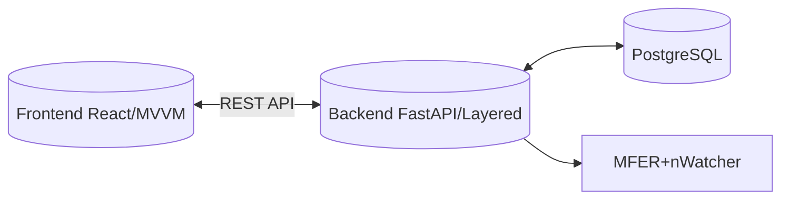
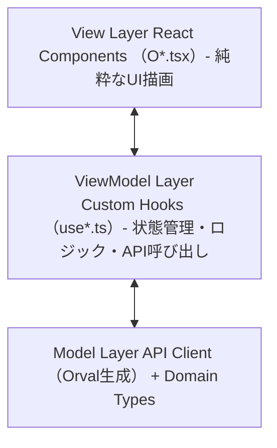
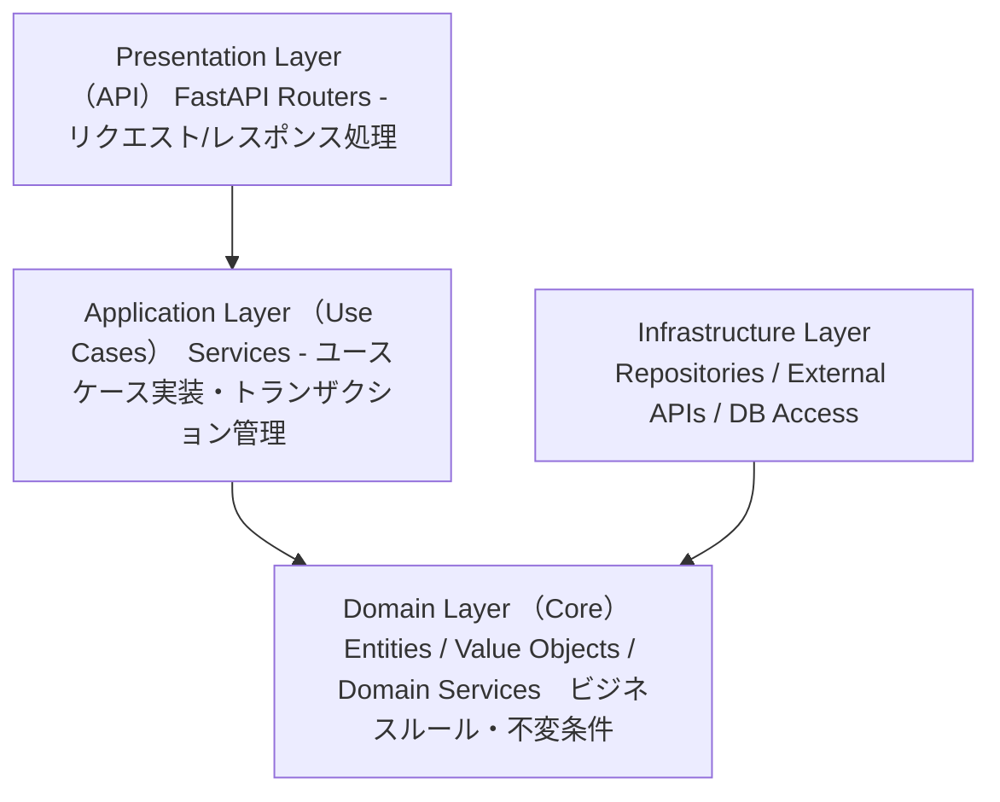

# Technology Stack

## Architecture

**ドメイン駆動設計（DDD）** を採用し、ビジネスロジックをドメイン層に集約。
フロントエンド・バックエンド分離のクライアント/サーバー型アーキテクチャ。



### Frontend: MVVM アーキテクチャ



| Layer | 責務 | 実装 |
|-------|------|------|
| **View** | UI描画、ユーザー操作受付 | React Components (*.tsx) |
| **ViewModel** | 状態管理、ビジネスロジック、API呼び出し | Custom Hooks (use*.ts) |
| **Model** | データ構造、API通信 | Orval生成クライアント、型定義 |

### Backend: Layered アーキテクチャ（DDD準拠）



| Layer | 責務 | 依存方向 |
|-------|------|---------|
| **Presentation** | HTTP処理、入出力変換 | → Application |
| **Application** | ユースケース調整、トランザクション | → Domain |
| **Domain** | ビジネスロジック、エンティティ | 依存なし（コア） |
| **Infrastructure** | 永続化、外部サービス | → Domain（実装提供） |

## Core Technologies

| Layer | Technology | Version |
|-------|------------|---------|
| **Frontend** | React + TypeScript | React 18+ |
| **Backend** | FastAPI (Python) | Python 3.14+ |
| **Database** | PostgreSQL | 15+ |
| **AI/ML** | PyTorch + Vision Transformer | - |

## Key Libraries

### Frontend
- **React**: UIフレームワーク（View層）
- **React Router**: ルーティング
- **TanStack Query**: サーバー状態管理（ViewModel層）
- **Orval**: OpenAPI仕様からAPIクライアント・型定義を自動生成（Model層）
- **Tailwind CSS**: スタイリング
- **Vite**: ビルドツール
- **Storybook**: UIコンポーネントカタログ・独立開発環境
- **Chromatic**: ビジュアルリグレッションテスト・Storybookホスティング

### Backend
- **FastAPI**: Web API フレームワーク
- **SQLAlchemy**: ORM
- **Alembic**: DBマイグレーション
- **Pydantic**: データバリデーション
- **PyTorch**: AI推論エンジン
- **Watchdog**: ファイル監視（MFERクローラー）

## Development Standards

### Type Safety
- Frontend: TypeScript strict mode、`any` 禁止
- Backend: Python type hints 必須、pyrefly で型チェック

### Database
- **プライマリーキー**: 全テーブルでUUID（`uuid.uuid4()`）を使用
- PostgreSQL の `UUID` 型を使用（文字列保存ではない）
- SQLAlchemy での実装例:
  ```python
  from sqlalchemy import Column
  from sqlalchemy.dialects.postgresql import UUID
  import uuid

  class BaseModel:
      id = Column(UUID(as_uuid=True), primary_key=True, default=uuid.uuid4)
  ```

### Code Quality

#### Frontend（ESLint + Prettier）
2025年時点で最も使用率が高い組み合わせ。
- **ESLint**: 静的解析（コード品質・バグ検出）
- **Prettier**: フォーマッター（コードスタイル統一）

#### Backend（pyrefly + ruff）
- **pyrefly**: 静的型解析（型エラー検出）
- **ruff**: Linter + Formatter（高速、Rust製）
  - `ruff check --fix`: lint + 自動修正
  - `ruff format`: フォーマット

### Pre-commit（Git Hooks）

コミット前に自動で静的解析・フォーマットを実行。
ルートに `.pre-commit-config.yaml` を配置し、FE/BE両方を統一管理。

```yaml
# .pre-commit-config.yaml
repos:
  # === Frontend ===
  - repo: local
    hooks:
      - id: frontend-eslint
        name: Frontend ESLint
        entry: bash -c 'cd frontend && npm run lint:fix'
        language: system
        files: ^frontend/.*\.(ts|tsx|js|jsx)$
        pass_filenames: false

      - id: frontend-prettier
        name: Frontend Prettier
        entry: bash -c 'cd frontend && npm run format'
        language: system
        files: ^frontend/.*\.(ts|tsx|js|jsx|css|json|md)$
        pass_filenames: false

  # === Backend ===
  - repo: local
    hooks:
      - id: backend-pyrefly
        name: Backend pyrefly (type check)
        entry: bash -c 'cd backend && pyrefly check .'
        language: system
        files: ^backend/.*\.py$
        pass_filenames: false

  - repo: https://github.com/astral-sh/ruff-pre-commit
    rev: v0.8.0
    hooks:
      - id: ruff
        name: Backend Ruff (lint + fix)
        args: [--fix]
        files: ^backend/
      - id: ruff-format
        name: Backend Ruff (format)
        files: ^backend/
```

**セットアップ:**
```bash
pip install pre-commit
pre-commit install
```

### Testing

#### Frontend（Vitest + React Testing Library）
- **Vitest**: Vite ネイティブのテストランナー（高速、HMR対応）
- **React Testing Library**: コンポーネントテスト
- **MSW (Mock Service Worker)**: API モック

```bash
npm run test              # テスト実行
npm run test:coverage     # カバレッジレポート
npm run test:watch        # ウォッチモード
```

#### Backend（pytest）
- **pytest**: テストフレームワーク
- **pytest-cov**: カバレッジ計測
- **pytest-asyncio**: 非同期テスト対応
- **httpx**: FastAPI TestClient用

```bash
pytest                           # テスト実行
pytest --cov=app --cov-report=html  # カバレッジレポート
pytest -v -x                     # 詳細表示、最初の失敗で停止
```

#### カバレッジ目標
| Layer | 目標 |
|-------|------|
| Frontend | 70% 以上 |
| Backend | 80% 以上 |

### CI/CD（GitHub Actions）

プルリクエスト・mainブランチへのプッシュ時に自動実行。

```yaml
# .github/workflows/ci.yml
name: CI

on:
  push:
    branches: [main, develop]
  pull_request:
    branches: [main, develop]

jobs:
  # === Frontend ===
  frontend:
    runs-on: ubuntu-latest
    defaults:
      run:
        working-directory: frontend
    steps:
      - uses: actions/checkout@v4
        with:
          fetch-depth: 0  # Chromatic用に全履歴取得
      - uses: actions/setup-node@v4
        with:
          node-version: '20'
          cache: 'npm'
          cache-dependency-path: frontend/package-lock.json
      - run: npm ci
      - run: npm run lint
      - run: npm run format:check
      - run: npm run test:coverage
      - run: npm run build
      - run: npm run build-storybook
      # Chromatic（ビジュアルリグレッションテスト）
      - uses: chromaui/action@latest
        with:
          projectToken: ${{ secrets.CHROMATIC_PROJECT_TOKEN }}
          workingDir: frontend

  # === Backend ===
  backend:
    runs-on: ubuntu-latest
    defaults:
      run:
        working-directory: backend
    services:
      postgres:
        image: postgres:15
        env:
          POSTGRES_USER: test
          POSTGRES_PASSWORD: test
          POSTGRES_DB: test_db
        ports:
          - 5432:5432
        options: >-
          --health-cmd pg_isready
          --health-interval 10s
          --health-timeout 5s
          --health-retries 5
    steps:
      - uses: actions/checkout@v4
      - uses: actions/setup-python@v5
        with:
          python-version: '3.14'
          cache: 'pip'
      - run: pip install -r requirements.txt -r requirements-dev.txt
      - run: pyrefly check .
      - run: ruff check .
      - run: ruff format --check .
      - run: pytest --cov=app --cov-fail-under=80
```

**CIで実行されるチェック:**
| Layer | チェック項目 |
|-------|-------------|
| Frontend | ESLint → Prettier → Vitest → Build → Storybook Build → Chromatic |
| Backend | pyrefly → Ruff (lint) → Ruff (format) → pytest (coverage 80%) |

**Chromatic セットアップ:**
1. [chromatic.com](https://www.chromatic.com/) でプロジェクト作成
2. `CHROMATIC_PROJECT_TOKEN` を GitHub Secrets に登録
3. PRごとにビジュアル差分を自動検出・レビュー

## Environment Strategy

### 開発環境（Docker Compose）
開発時は Docker Compose を使用し、全サービスをコンテナで起動。
環境差異をなくし、チーム間で統一された開発環境を提供。

```yaml
# docker-compose.yml 構成
services:
  frontend:    # React dev server (hot reload)
  backend:     # FastAPI (uvicorn --reload)
  db:          # PostgreSQL
  watcher:     # MFER file watcher (optional)
```

### 本番環境（ローカルインストール）
商用運用では対象PCに直接インストールして実行。
- Frontend: ビルド済み静的ファイルを配信（nginx or backend から serve）
- Backend: システムサービスとして起動
- Database: ローカル PostgreSQL インスタンス

```bash
# 本番デプロイイメージ
/opt/ecg-mi-inference/
├── frontend/dist/      # ビルド済みフロントエンド
├── backend/            # Python アプリケーション
├── venv/               # Python 仮想環境
└── config/             # 環境設定ファイル
```

## Development Environment

### Required Tools

| Tool | Version | Purpose |
|------|---------|---------|
| Docker | 24+ | コンテナ実行 |
| Docker Compose | v2+ | マルチコンテナ管理 |
| Node.js | 20+ | フロントエンドビルド（本番デプロイ時） |
| Python | 3.11+ | バックエンド実行（本番デプロイ時） |
| PostgreSQL | 15+ | データベース（本番デプロイ時） |
| pre-commit | 3.0+ | Git hooks管理（コミット前の品質チェック） |

### Common Commands

```bash
# === 開発（Docker Compose） ===
docker compose up -d          # 全サービス起動
docker compose logs -f        # ログ確認
docker compose down           # 停止

# === フロントエンド（コンテナ内 or ローカル） ===
npm run dev                   # 開発サーバー起動
npm run build                 # 本番ビルド
npm run test                  # テスト実行
npm run generate:api          # Orval: OpenAPIからAPI型・クライアント生成
npm run storybook             # Storybook起動（localhost:6006）
npm run build-storybook       # Storybookビルド
npx chromatic                 # Chromaticへデプロイ・ビジュアルテスト

# === バックエンド（コンテナ内 or ローカル） ===
uvicorn app.main:app --reload # 開発サーバー起動
pytest                        # テスト実行
alembic upgrade head          # DBマイグレーション

# === Pre-commit ===
pre-commit install            # Git hooks インストール（初回のみ）
pre-commit run --all-files    # 全ファイルに対して実行

# === 本番デプロイ ===
./scripts/install.sh          # インストールスクリプト
./scripts/start.sh            # サービス起動
```

## Key Technical Decisions

| 決定事項 | 理由 |
|---------|------|
| **アーキテクチャ** | |
| DDD（ドメイン駆動設計） | 医療ドメインの複雑なビジネスルールを明確に表現、保守性向上 |
| MVVM（Frontend） | View/ViewModel分離でテスト容易性向上、Storybook連携に最適 |
| Layered（Backend） | 責務分離による保守性、DDD実践に適した構造 |
| **技術スタック** | |
| React（Next.js なし） | SSR不要、シンプルなSPA構成で十分 |
| FastAPI | 型安全、自動APIドキュメント生成、非同期対応 |
| PostgreSQL | 医療データの信頼性、JSON対応、拡張性 |
| UUID（プライマリーキー） | 分散環境での一意性保証、連番によるデータ推測防止、セキュリティ向上 |
| **開発環境** | |
| Docker Compose（開発のみ） | 環境統一、セットアップ簡略化 |
| ローカルインストール（本番） | 医療機関のネットワーク制約、オフライン運用対応 |
| **コード品質** | |
| Orval（API型定義） | FastAPIのOpenAPI仕様から型・クライアントを自動生成、手動定義の二重管理を排除 |
| pre-commit（ルート統一） | FE/BEを1箇所で管理、Docker開発でPython環境あり、コード品質の自動担保 |
| ESLint + Prettier（FE） | 2025年時点で最も使用率が高く、エコシステムが成熟 |
| pyrefly + ruff（BE） | pyreflyで厳密な型チェック、ruffで高速lint/format（Rust製） |
| **テスト・UI開発** | |
| Vitest（FE テスト） | Viteネイティブで高速、Jest互換API、HMR対応 |
| pytest（BE テスト） | Pythonテストのデファクトスタンダード、プラグインエコシステム充実 |
| Storybook | コンポーネント単独開発、UIカタログ、デザインシステム構築 |
| Chromatic | ビジュアルリグレッションテスト、Storybookホスティング、PRレビュー効率化 |
| **CI/CD** | |
| GitHub Actions（CI） | GitHubとのシームレス統合、PR/pushトリガー、マトリクスビルド対応 |

---
_Document standards and patterns, not every dependency_

